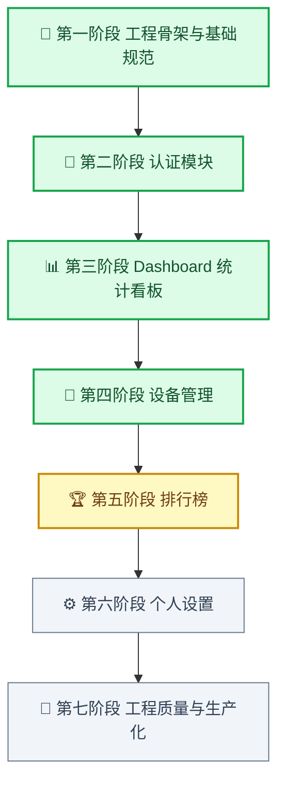
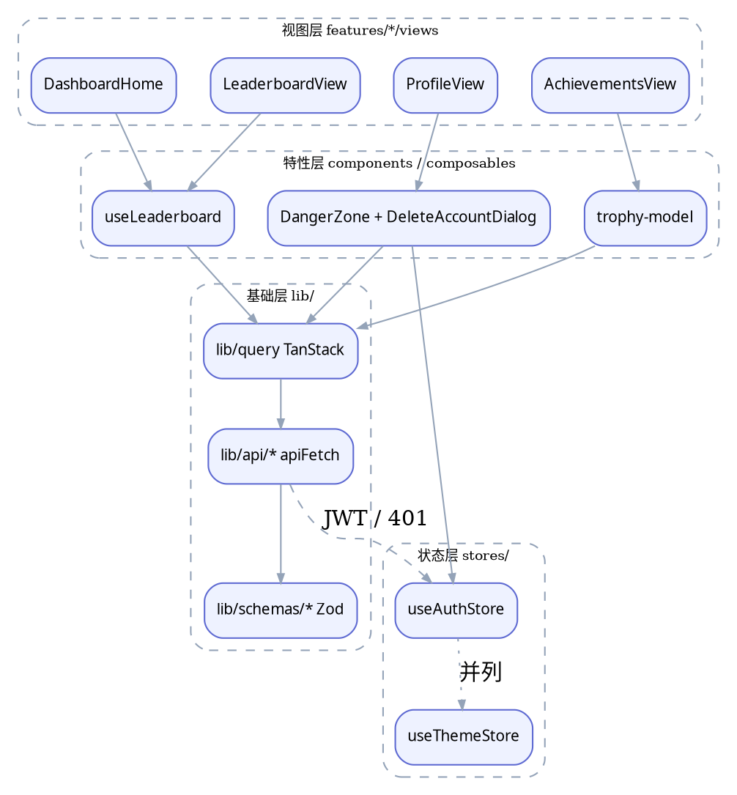
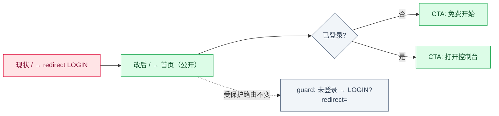

# ctt-web 开发计划

> **来源**：2026-09-18 自 Notion「🌐 ctt-web 开发计划」迁入，此后以本文件为准，Notion 不再维护。
> **语言**：本目录用中文 —— 它由 AI 维护，但**是给人看的**，需要人机共读。
>
> ## 与其他文档的分工
>
> | 目录 | 定位 | 读者 |
> |------|------|------|
> | **`.plans/`**（本目录） | 规划、阶段计划、交付记录、归档材料 | **人机共读**，中文 |
> | `docs/` | 面向用户的项目文档（`architecture.md` / `dev-handbook.md`） | 人，英文 |
> | `memory-bank/` | AI 的工程记忆与领域知识（受 AGENTS.md R1/R2/R24 治理） | AI 为主 |
> | `.agents/` | AI 技能工作区（R16 保护，勿动） | AI |
>
> ## 使用约定
>
> - 新的规划类、归档类文档直接放本目录，命名用 `kebab-case.md`
> - 阶段完成后**在本文件对应章节就地更新**（标题打 已完成、交付清单改状态、补「完成记录」），不要另起一份
> - 与代码冲突时**以代码为准**：本文件记录的是计划与当时的判断，不是权威契约来源；接口契约以 `../ctt-server` 源码与 `memory-bank/domains/backend-contract/` 为准
> - 本目录**只进 develop，不进 master**


---

## 🗺️ 阶段总览

对比计划与实际状态，先看图再看细节。**绿=已完成，黄=部分完成，灰=未开始**。



| 阶段 | 状态 | 缺口 |
|------|------|------|
| 第一阶段 工程骨架 | ✅ 已完成 | — |
| 第二阶段 认证模块 | ✅ 已完成 | — |
| 第三阶段 Dashboard 统计看板 | ✅ 已完成 | 成就独立成页而非面板（已定案） |
| 第四阶段 设备管理 | ✅ 已完成 | — |
| 第五阶段 排行榜 | **部分完成** | L3 行高亮与「跳转到我的排名」；L4 虚拟滚动（方案已改为显式分页） |
| 第六阶段 个人设置 | 未开始 | 主题切换已具备（`useThemeStore`），语言切换待 i18n |
| 第七阶段 工程质量与生产化 | 未开始 | 首屏预算、i18n 等 |

### 功能地图

阶段看顺序，这张看结构：每个模块里到底有什么，以及**逐项**的完成度。

颜色即状态：绿=已上线，黄=部分完成，灰=未做。

```plantuml
@startmindmap
*[#1565C0] ctt-web
** 统计看板
[#C8E6C9] 6 项概览卡片
[#C8E6C9] 热力图（年份选择 + streak）
[#C8E6C9] 趋势 / 语言 / 项目分布
[#C8E6C9] 星期×小时 / 时段 / 每小时均值
[#C8E6C9] 近期会话
left side
**[#C8E6C9] 排行榜
[#C8E6C9] 7 维度 × 合法周期 = 24 榜
[#C8E6C9] 语言分区榜（842 种词表）
[#FFF9C4] 行高亮与「跳转到我的排名」
[#E0E0E0] 虚拟滚动（已改为显式分页）
**[#C8E6C9] 成就奖杯
[#C8E6C9] 67 徽章 / 14 条阶梯
[#C8E6C9] 周期历史 + 外圈几何
**[#C8E6C9] 设备管理
[#C8E6C9] 列表 / 吊销 / 错误码映射
**[#C8E6C9] 认证与账号
[#C8E6C9] 注册 / 登录 / 刷新 / 重置
[#C8E6C9] GitHub OAuth 绑定
[#C8E6C9] 账号删除（Danger zone）
**[#E0E0E0] 待办
[#E0E0E0] i18n 接入
[#E0E0E0] 与后端真实联调记录
@endmindmap
```
### 依赖分层

功能地图看「有什么」，这张看「怎么搭」—— 依赖只能自上而下，组件不直接发请求。




## 项目定位
ctt-web 是 code-time-tracker 的 Web 前端，基于 Vue 3 + Vite 构建，为开发者提供编码时间统计看板、设备管理、全球排行榜等可视化能力。本文档分为「基础建设」与「功能开发计划」两部分。

## 🧱 第一阶段：工程骨架与基础规范
### 目标与边界
这一阶段的交付物不是「用户能看到页面」，而是一套后续所有功能开发都能复用的工程底座。
**本阶段明确不交付：**
- 任何业务功能页面
- API 调用逻辑
- 认证流程

### 1：构建工具链与项目结构 ✅ 已完成
**目标：** 建立可长期维护的工程骨架
- [x] 初始化 Vite 8 + Vue 3 + TypeScript Strict 项目
- [x] 配置 `tsconfig.json`（strict mode，path alias `@/`）
- [x] 建立 `src/` 目录结构：`features/`、`components/ui/`、`composables/`、`lib/api/`、`lib/schemas/`、`stores/`、`router/`、`i18n/`
- [x] 配置 Tailwind CSS v4（`@tailwindcss/vite` 插件）
- [x] 安装并配置 shadcn-vue + Radix Vue 基础组件
- [x] 配置 `@iconify/vue` 图标方案
**交付物：** 可运行的空项目骨架 / `src/` 目录规范 / Tailwind + shadcn-vue 可用
**验收：** `pnpm dev` 正常启动；Tailwind 类名生效；shadcn-vue Button 组件可渲染

### 2：代码质量工具链 ✅ 已完成
**目标：** 建立自动化质量保障底线，让坏代码无法进入仓库
- [x] 配置 Oxlint（`oxlint.json`）作为主 linter
- [x] 配置 Oxfmt（`.oxfmtrc`）作为格式化工具
- [x] 配置 ESLint（仅 `@vitest/eslint-plugin` + `eslint-plugin-playwright` 补充规则）
- [x] 配置 `simple-git-hooks` + `lint-staged`：pre-commit 自动 lint & format
- [x] 配置 `vue-tsc` 类型检查脚本
- [x] 配置 `.editorconfig`：2 空格缩进、LF、UTF-8
- [x] 建立 `package.json` scripts：`dev` / `build` / `preview` / `type-check` / `lint` / `format` / `test:unit` / `test:e2e`
**交付物：** `oxlint.json` / `.oxfmtrc` / `eslint.config.ts` / `.editorconfig` / `simple-git-hooks` 配置
**验收：** 提交含 `any` 类型的代码时 pre-commit 拦截；`pnpm lint` 全绿；`pnpm type-check` 无报错

### 3：路由体系与布局框架 ✅ 已完成
**目标：** 建立路由结构与页面布局，所有页面都有归属
- [x] 配置 Vue Router 4，路由表按 feature 分组
- [x] 实现 `AuthLayout`（登录/注册用，无侧边栏）和 `AppLayout`（主应用，含顶部导航 + 侧边栏）
- [x] 实现路由守卫：未登录访问受保护路由 → 跳转 `/login` 并保存 `redirect` 参数
- [x] 所有 feature 路由使用 `() => import(...)` 懒加载
- [x] 定义路由名称常量（避免硬编码字符串）
- [x] 建立 `NotFoundPage` 和 `ErrorBoundary` 组件
**交付物：** 路由表 / 双 Layout 组件 / 路由守卫 / 懒加载配置
**验收：** 访问 `/dashboard`（未登录）自动跳转 `/login?redirect=/dashboard`；页面切换有路由懒加载 chunk 分割

### 4：HTTP 层与状态管理基线 ✅ 已完成
**目标：** 建立统一的 API 调用边界，杜绝组件直接发请求
- [x] 封装 `lib/api/instance.ts`：`ofetch` 实例，统一携带 JWT Bearer header
- [x] 实现 401 响应拦截：自动清除 auth store → 重定向 `/login`
- [x] 定义公共 Zod Schema：`createApiResponseSchema<T>` / `createPagedResponseSchema<T>` / `ApiErrorSchema`
- [x] 配置 TanStack Query（`@tanstack/vue-query`）：`QueryClient` 全局注入，默认 `staleTime: 30s`
- [x] 初始化 Pinia：`useAuthStore`（JWT token + user info）/ `useThemeStore`（dark/light，持久化）
- [x] 实现 `useAuthStore` 的 token 刷新逻辑（含 Thundering Herd 并发保护）
**交付物：** `lib/api/instance.ts` / `lib/schemas/api.schema.ts` / `stores/auth.ts` / `stores/theme.ts` / `lib/query.ts`
**验收：** 发出请求时 Authorization header 自动携带；返回 401 时自动跳转登录页；Pinia DevTools 可观测 store 状态

### 5：测试基线与 Git 工程规范 ✅ 已完成
**目标：** 建立测试脚手架与提交规范，后续功能开发不需重新搭环境
- [x] 配置 Vitest + `@testing-library/vue`：`vitest.config.ts`，jsdom 环境
- [x] 配置 Playwright：`playwright.config.ts`，**仅 chromium 单引擎**（firefox / webkit 项目已移除：从未有针对它们的断言，且会让 `pnpm test:e2e` 在启动阶段失败——一个从不运行的项目是失败步骤而非覆盖率），含 trace / video / screenshot / retry 配置
- [x] 建立测试 fixture 工具：`buildLoginRequest` / `buildLoginResponse` / API response builder（基于 `@faker-js/faker`）
- [x] 配置 `.gitmessage` commit 模板（Conventional Commits 格式，含 11 种 type + 示例）
- [x] 输出《开发手册》`docs/dev-handbook.md`：如何新增路由、如何新增 API 调用、如何写组件测试
**交付物：** `vitest.config.ts` / `playwright.config.ts` / `src/test/factories/` / `.gitmessage` / `docs/dev-handbook.md`
**验收：** `pnpm test:unit` 运行示例测试全绿；`pnpm test:e2e` 能启动浏览器执行 hello world 用例

### 基础建设总交付清单
| 交付项 | 结果 |
|---|---|
| 构建工具链 | Vite 8 + TypeScript Strict 可运行 |
| 代码质量 | Oxlint + Oxfmt + pre-commit 自动拦截 |
| 路由与布局 | 双 Layout + 路由守卫 + 懒加载 |
| HTTP 层 | ofetch 实例 + Zod Schema + 401 拦截 |
| 状态管理 | TanStack Query + Pinia auth/theme |
| 测试基线 | Vitest + Playwright 脚手架就绪 |
| 工程规范 | Commit 模板 + 开发手册 |
---
## 🔐 第二阶段：认证模块
### 目标与边界
打通与 ctt-server 的 JWT 认证闭环，为所有后续页面提供安全上下文。复用第一阶段所有基础：`useAuthStore`、`apiFetch` 拦截器、`lib/schemas/`、`vee-validate + Zod` 表单校验。
> 待确认 **后端接口基准**：所有接口均位于 `POST /api/v1/auth/*`，认证方式为 JWT Bearer，并发限速通过服务端 `@RateLimit` 注解实现，前端需处理 `429` 响应。ctt-server 与本模块**并行开发**。**实际未采用 MSW**：接口契约直接对照 ctt-server 源码核实（项目 R13 规范），端到端验证用 Playwright 的 `page.route()` 拦截请求 —— 项目从未引入 MSW（详见后文 API Key 模块 K 节的同名说明）。n**本阶段明确不交付：**
- 社交账号绑定（第三方账号关联已有 ctt 账号的合并逻辑）

### A：注册页与邮箱验证 ✅ 已完成
**目标：** 实现邮箱密码注册 → 邮箱验证 → 激活账号的完整闭环
> 📌 **接口**：`POST /api/v1/auth/register`（限速 60次/小时/IP）→ `GET /api/v1/auth/verify-email?token=xxx` → `POST /api/v1/auth/resend-verification`（限速 3次/分钟/邮箱）
**1. Schema 层**
- [x] `RegisterRequestSchema`：`email`（`z.string().email()`）、`displayName`（匹配后端 `REGEX_DISPLAY_NAME` 正则）、`password`（`StrongPasswordSchema`：8+位、大写、小写、数字、特殊字符各一）、`confirmPassword`（纯前端二次确认，不发送后端）
- [x] `VerifyEmailParamSchema`：`token`（`z.string().min(1)`）
- [x] `ResendVerificationRequestSchema`：`email`（`z.string().email()`）
**2. API 层（`lib/api/auth.ts`）**
- [x] `register(data: RegisterRequest): Promise<EmptyResponse>`
- [x] `verifyEmail(token: string): Promise<EmptyResponse>`
- [x] `resendVerification(email: string): Promise<EmptyResponse>`
**3. 页面与组件**
- [x] `features/auth/RegisterView.vue`：邮箱 + 显示名 + 密码 + 确认密码，`vee-validate` + `RegisterRequestSchema`
- [x] 密码实时强度计 UI（进度条），实时匹配 `@StrongPassword` 四条规则，逐条打勾显示
- [x] 注册成功后**不自动登录**，跳转到「请查收验证邮件」提示页（`RegisterSuccessView.vue`），含「重新发送」入口
- [x] `features/auth/VerifyEmailView.vue`（路由 `/verify-email`）：挂载后自动读取 `?token` 调用 `verifyEmail()`，成功展示 已完成 引导登录，失败展示 待确认 失效提示并附「重新发送」按钮
- [x] `useResendVerification` composable：封装 `resendVerification` 调用 + 前端 60s 冷却倒计时，暴露 `{ resend, countdown, isPending }`
- [x] 错误映射：`409 USER_001` → 行内「该邮箱已被注册」；`429` → toast 含冷却倒计时
- [x] 错误映射（待补）：`409 USER_002` → 行内「该邮箱已完成验证」（当前实现走通用 toast，未做字段级行内报错）
**交付物清单：**
| 类型 | 文件 | 状态 |
|---|---|---|
| Schema | `lib/schemas/auth.schema.ts`（新增注册/验证 Schema） | ✅ 已完成 |
| API | `lib/api/auth.ts`（`register` / `verifyEmail` / `resendVerification`） | ✅ 已完成 |
| Page | `features/auth/views/RegisterView.vue`（规划名 RegisterPage，等价） | ✅ 已完成 |
| Page | `features/auth/views/RegisterSuccessView.vue`（规划名 RegisterSuccessPage，等价） | ✅ 已完成 |
| Page | `features/auth/views/VerifyEmailView.vue`（规划名 VerifyEmailPage，等价） | ✅ 已完成 |
| Composable | `features/auth/composables/useResendVerification.ts` | ✅ 已完成 |
| Component | `features/auth/components/RegisterForm.vue`（超额拆分） | 额外交付 |
| Component | `features/auth/components/PasswordStrengthMeter.vue`（超额拆分） | 额外交付 |
**验收标准：**
1. 注册成功后跳转提示页，不自动登录，`useAuthStore().isAuthenticated` 为 `false`
2. 密码强度计四条规则实时联动，全满才允许提交
3. `?token` 有效时 `VerifyEmailView` 自动验证并展示成功态，`?token` 无效时展示失效提示含重发入口
4. `resend` 触发后按钮进入 60s 倒计时禁用态，倒计时结束恢复
5. `409 USER_001` 时邮箱字段行内报错，不清空密码字段

### B：登录页与 JWT 获取 ✅ 已完成
**目标：** 实现邮箱密码登录，安全存储 JWT，建立 auth 上下文
> 📌 **接口**：`POST /api/v1/auth/login`（限速 30次/小时/IP）
> **待确认 注意**：`deviceId` 字段为**必填**（`@NotBlank`），前端需在 `localStorage` 生成并持久化，每次登录透明附加
**1. Schema 层**
- [x] 更新 `LoginRequestSchema`：`email`（`z.string().email()`）、`password`（`StrongPasswordSchema`，与 `@StrongPassword` 注解规则对齐）、`deviceId`（`z.string().min(1)`，**必填**，非 optional）
- [x] 确认 `LoginResponseSchema`：`userId`（UUID string）、`accessToken`、`refreshToken`、`expiresIn`（number，秒）、`tokenType`（固定 `\"Bearer\"`）
**2. `deviceId` 工具（`lib/utils/device.ts`）**
- [x] `getOrCreateDeviceId(): string`：首次用 `crypto.randomUUID()` 生成，写入 `localStorage(\"ctt-device-id\")`，后续复用
- [x] `authStore` 初始化时调用，挂到 store state，登录调用透明传入
**3. API 层（`lib/api/auth.ts`）**
- [x] `login(data: LoginRequest): Promise<LoginResponse>`
- [x] `refreshToken(refreshToken: string): Promise<LoginResponse>`（对应 `POST /api/v1/auth/refresh`，请求体 `{ refreshToken }`）
- [x] `logoutAll(): Promise<void>`（对应 `POST /api/v1/auth/logout-all`，需携带 Bearer token，服务端限速 5次/分钟/USER）
**4. 页面层**
- [x] 实现 `features/auth/views/LoginView.vue`：邮箱 + 密码表单，`vee-validate` + `LoginRequestSchema` 校验（实际拆分为 `LoginForm.vue` 组件 + `LoginView.vue` 容器）
- [x] 登录成功后：`useAuthStore().setAuth(response)` → 跳转 `redirect` 参数或默认 `/dashboard`
- [x] 错误映射：`401 AUTH_001` → 行内「邮箱或密码错误」；`403 AUTH_006` → Dialog「邮箱未验证」+「重新发送验证邮件」按钮；`403 AUTH_005` → toast「账号已被禁用」；`429` → toast「请求过于频繁」
- [x] 新增「还没有账号？注册」入口链接到 `/register`（实际文案 "Create account"）
- [x] 提交期间 Button 展示 loading 状态，防止重复提交
**交付物清单：**
| 类型 | 文件 | 状态 |
|---|---|---|
| Schema | `lib/schemas/auth.schema.ts`（更新 `LoginRequestSchema`，新增 `LoginResponseSchema`） | ✅ 已完成 |
| Util | `lib/utils/device.ts` | ✅ 已完成 |
| API | `lib/api/auth.ts`（`login` / `refreshToken` / `logoutAll`） | ✅ 已完成 |
| Page | `features/auth/views/LoginView.vue` | ✅ 已完成 |
| Store | `stores/auth.ts`（`setAuth` 已有，补充 `deviceId` 初始化） | ✅ 已完成 |
**验收标准：**
1. 已完成 正确凭证登录后跳转 Dashboard，`useAuthStore().isAuthenticated` 为 `true`
2. 已完成 错误凭证展示内联错误提示，不白屏，不跳转
3. 已完成 登录状态刷新页面后不丢失（`useStorage` 持久化）
4. 已完成 表单字段为空或格式非法时，提交按钮被禁用或展示校验错误
5. 已完成 Network tab 中每次登录请求均携带 `deviceId` 字段

### C：Token 自动刷新与全局登出 ✅ 已完成
**目标：** Access token 过期时无感刷新；登出时吊销所有设备 session；多并发 401 只触发一次 refresh
> 📌 **接口**：`POST /api/v1/auth/refresh`（请求体 `{ refreshToken }`，限速 120次/小时/IP）/ `POST /api/v1/auth/logout-all`（需 Bearer token，限速 5次/分钟/USER）
**1. ofetch 拦截器增强 已完成 v0.5.18 已完成（`lib/api/instance.ts`）**
- [x] 在 `onResponseError` 的 `401 AUTH_002` 分支中，先尝试 `useAuthStore().refreshAccessToken()`
- [x] 刷新成功 → 用新 token 重新发起原请求
- [x] 刷新失败处理：`401 AUTH_003/AUTH_007`（refresh token 无效/过期）→ `clearAuth()` → 跳转 `/login`；`403 AUTH_006`（邮箱未验证）→ `clearAuth()` → 跳转验证提示页；`403 AUTH_004/AUTH_005`（账号锁定/禁用）→ `clearAuth()` → 跳转 `/login` 展示对应提示；`403 AUTH_009`（Token reuse detected，安全事件）→ `clearAuth()` → 跳转 `/login` + 安全警告提示
- [x] 竞态保护已在 `useAuthStore.refreshAccessToken()` 通过 Promise 去重锁实现 已完成
> 📝 **v0.5.18 实现说明**：后端 `JwtAuthenticationEntryPoint` 对所有 JWT 失败统一返回 `AUTH_003`（非规划中的 AUTH_002），因此拦截器以 AUTH_003 作为刷新触发码。`getErrorCode()` 同时支持扁平 `ErrorResponse` 和包装 `RestApiResponse` 两种响应格式。重试使用 `apiFetch()` 而非原生 `ofetch()` 确保 `onRequest` hook 携带新 token。18 个单元测试覆盖刷新/终端错误/mutex/重试守卫。
**2. `useAuthStore` 补充 已完成 v0.5.19 已完成**
- [x] 实现 `logout()` action：调用 `lib/api/auth.logoutAll()` → `clearAuth()` → `router.push('/login')`
- [x] **fail-safe 原则**：即使 `logoutAll()` 接口失败（网络断开、429 限速），也必须执行本地 `clearAuth()`，不能因为接口报错阻断登出
- [x] 主动刷新调度：store `setAuth()` 时，用 `expiresIn` 计算 `expiresAt = Date.now() + expiresIn * 1000`；在 `expiresAt - 5分钟` 时用 `setTimeout` 触发后台静默刷新
**3. 导航栏接入**
- [x] 顶部导航「退出登录」按钮调用 `useAuthStore().logout()`
- [x] 登出期间展示 loading 状态，防止重复点击（`isPending` 禁用按钮）
**交付物清单：**
| 类型 | 文件 | 状态 |
|---|---|---|
| 拦截器增强（401 刷新 + 终端错误处理 + 竞态保护） 已完成 v0.5.18 | `lib/api/instance.ts`（增强 401 处理，区分 AUTH_002/AUTH_003） | ✅ 已完成 |
| Store | `stores/auth.ts`（新增 `logout()` • 主动刷新调度 已完成 v0.5.19） | ✅ 已完成 |
| API | `lib/api/auth.ts`（`logoutAll` 已在子任务 B 定义） | 复用 |
| Component | 顶部导航组件（接入退出登录按钮） | ✅ 已完成 |
**验收标准：**
1. Access token 手动设为过期值后发请求，自动刷新成功且用户无感知
2. 同时发出 3 个请求触发 `401`，`POST /api/v1/auth/refresh` 接口只被调用一次
3. Refresh token 过期时，所有请求失败后统一跳转 `/login`，不出现多次跳转
4. 点击退出登录后跳转 `/login`，`localStorage` 中 token 已清除；即使服务端 `logout-all` 返回 `429` 也能正常登出

### D：忘记密码与重置密码 ✅ 已完成
**目标：** 实现忘记密码邮件发送 → token 验证 → 新密码确认的完整重置链路
> 📌 **接口**：`POST /api/v1/auth/forgot-password`（邮箱限速 3次/10分钟 + IP限速 30次/小时）→ `POST /api/v1/auth/password-reset/confirm`（IP限速 15次/10分钟）
> **待确认 Anti-enumeration**：服务端无论邮箱是否存在始终返回 200，前端不得从响应推断邮箱是否已注册
**1. Schema 层**
- [x] `ForgotPasswordRequestSchema`：`email`（`z.string().email()`）
- [x] `ResetPasswordRequestSchema`：`token`（`z.string().min(1)`）、`newPassword`（`StrongPasswordSchema`）、`confirmPassword`（纯前端二次确认，不发送）
**2. API 层（`lib/api/auth.ts`）**
- [x] `forgotPassword(data: ForgotPasswordRequest): Promise<void>` (Arch refinement: Void contract)
- [x] `confirmPasswordReset(data: ResetPasswordRequest): Promise<void>`
**3. 页面层**
- [x] `features/auth/views/ForgotPasswordView.vue`（路由 `/forgot-password`）：仅 `email` 字段，成功后**始终**展示通用成功提示「如邮箱已注册，重置链接已发送」，不区分邮箱是否存在
- [x] `features/auth/views/ResetPasswordView.vue`（路由 `/reset-password`）：从 URL `?token=xxx` 读取 token，展示新密码 + 确认密码表单
- [x] 重置成功 → 跳转 `/login`，toast 提示「密码已重置，所有设备已强制下线」
- [x] 错误映射：`401 AUTH_003` → 「重置链接已失效或已使用，请重新申请」；`409 PASSWORD_SAME_AS_OLD` → 新密码字段行内「新密码不能与当前密码相同」；`429` → toast 含冷却提示
**交付物清单：**
| 类型 | 文件 | 状态 |
|---|---|---|
| Schema | `lib/schemas/auth.schema.ts`（新增忘记/重置密码 Schema） | ✅ 已完成 |
| API | `lib/api/auth.ts`（`forgotPassword` / `confirmPasswordReset`） | ✅ 已完成 |
| Page | `features/auth/views/ForgotPasswordView.vue` | ✅ 已完成 |
| Page | `features/auth/views/ResetPasswordView.vue` | ✅ 已完成 |
**验收标准：**
1. 忘记密码提交后无论邮箱是否存在，UI 始终展示通用成功态，不泄露账号信息
2. 重置密码页 `?token` 缺失时展示「链接无效」提示，不渲染表单
3. `401 AUTH_003` 时表单禁用，展示失效提示含「重新申请」入口链接到 `/forgot-password`
4. `409 PASSWORD_SAME_AS_OLD` 时新密码字段行内报错，不重置整个表单

### E：GitHub OAuth 登录 ✅ 已完成
**目标：** 以最小改动量将 GitHub 登录无缝接入现有认证体系，不破坏已有 JWT 流程
> 📌 **接口**：`GET /api/v1/auth/oauth/github/authorize?action=login`（公共端点，无需 JWT）→ 后端回调 `/oauth/callback?accessToken=xxx&refreshToken=xxx&termsExpired=false`
> **待确认 state 校验**：由后端处理，前端无需维护 state 存储。state 无效时后端重定向到 `/oauth/error`
**1. 授权入口**
- [x] 登录页新增「使用 GitHub 登录」按钮，点击后调用 `getGitHubAuthorizeUrl('login')` 获取授权 URL
- [x] 跳转前在 `sessionStorage` 存入当前 `redirect` 目标，回调后恢复跳转（`LoginView.vue` 存储，`OAuthCallbackView.vue` 读取并清理）
- [x] 按钮展示 GitHub 品牌图标（SVG），视觉上与「邮箱登录」区分但同属一个登录卡片（由 "or" 分割线分隔）
**2. 回调页**
- [x] 新增 OAuth 回调落地页 `OAuthCallbackView.vue`，挂载后自动提取 URL 中的 `accessToken`、`refreshToken`、`termsExpired`
- [x] 后端校验 `state` 参数，无效时重定向到 `/oauth/error` 页面展示错误提示
- [x] 校验通过后调用 `authStore.loginWithOAuth()` 存储 token，走与邮箱登录完全相同的认证流程
- [x] 服务端返回错误时，`OAuthErrorView.vue` 展示对应错误提示（13 种错误码映射）并提供「Try again」按钮返回登录页
- [x] 页面整个过程对用户不可感，仅展示一个过渡 loading 态（"Completing sign in..."），不暴露授权码等敏感参数
- [x] URL 清理：`history.replaceState(null, '', route.path)` 防止 token 泄露到浏览器历史
**3. 与现有认证体系的衔接**
- [x] OAuth 登录换取的 JWT 结构与邮箱登录完全一致，`useAuthStore` 无需区分登录来源
- [x] Token 刷新（`scheduleSilentRefresh`）、主动刷新调度、fail-safe 登出逻辑（`clearAuth`）全部复用，无需为 OAuth 单独处理
**4. MSW handler（已取消）**
- **原计划**：覆盖三种场景——模拟授权成功、`state` 校验失败、账号异常
- **取消原因**：后端 OAuth 接口已部署（ctt-server v0.34.0），无需 mock；项目目前未使用 MSW，引入会增加不一致性；单元测试已通过 `vi.mock` 覆盖各种场景（25 个测试用例）；验收标准已通过真实后端验证，无需额外 mock 层
**交付物清单：**
| 类型 | 文件 | 状态 |
|---|---|---|
| API | `lib/api/auth.ts`（`getGitHubAuthorizeUrl('login')`） | ✅ 已完成 |
| Schema | `lib/schemas/auth.schema.ts`（`GitHubAuthorizeResponseSchema`） | ✅ 已完成 |
| Store | `stores/auth.ts`（`loginWithOAuth()` 方法，JWT 解码 + token 存储 + 刷新调度） | ✅ 已完成 |
| Page | `features/auth/views/LoginView.vue`（GitHub 按钮 + sessionStorage 存储 redirect） | ✅ 已完成 |
| Page | `features/auth/views/OAuthCallbackView.vue`（回调处理 + URL 清理 + redirect 恢复） | ✅ 已完成 |
| Page | `features/auth/views/OAuthErrorView.vue`（13 种错误码映射 + 返回登录页） | ✅ 已完成 |
| Component | `features/auth/components/LoginForm.vue`（GitHub 按钮 UI + Captcha 集成） | ✅ 已完成 |
| Router | `router/modules/oauth.ts`（`/oauth/callback` • `/oauth/error` 路由） | ✅ 已完成 |
**验收标准：**
1. 已完成 点击 GitHub 登录按钮，跳转 URL 含合法 `state` 参数（由 `getGitHubAuthorizeUrl('login')` 返回的 `authUrl` 包含）
2. 已完成 回调页在 `state` 不匹配时，后端重定向到 `/oauth/error`，前端展示错误提示（`OAuthErrorView.vue`）
3. 已完成 授权成功后 `useAuthStore().isAuthenticated` 为 `true`，行为与邮箱登录一致（`loginWithOAuth` 复用 token 存储逻辑）
4. 已完成 整个回调过程用户不会看到授权码出现在可见 UI 中（URL 清理 `history.replaceState`，UI 仅显示 loading）
5. 已完成 服务端返回账号异常错误时，展示明确提示，不白屏（`OAuthErrorView.vue` 映射 13 种错误码）
6. 已完成 sessionStorage redirect 存储/恢复正常工作（`LoginView.vue` 存储，`OAuthCallbackView.vue` 读取并清理）
**测试覆盖：**
- `OAuthCallbackView.test.ts`：15 个测试用例（happy path、缺失 token、termsExpired、安全/不安全 redirect、URL 清理）
- `OAuthErrorView.test.ts`：10 个测试用例（错误码映射、按钮跳转、默认回退）
- `auth.test.ts`：`loginWithOAuth` 方法测试
- `oauth-account.test.ts`：`getGitHubAuthorizeUrl` API 测试

### F：认证模块集成测试 （单元+组件+E2E） ✅ 已完成
**目标：** 核心认证链路有自动化测试保障，不靠手动回归
**单元测试（Vitest）：**
- [x] auth store 核心 actions：`setAuth` / `clearAuth` / `refreshAccessToken` 竞态保护 / `logout` fail-safe
- 测试文件：`src/stores/__tests__/auth.test.ts`（567 行，覆盖初始化、setAuth、clearAuth、clearRefreshTimer、initializeAuth、fetchUserProfile、login）
- [x] auth API 层：Mock 网络层，验证登录 / 刷新 / 登出请求的参数构造与响应处理
- 测试文件：`src/lib/api/__tests__/auth.test.ts`（781 行，覆盖 login、refresh、logoutAll、register、verifyEmail、resendVerification、forgotPassword、confirmPasswordReset、acceptTerms、getGitHubAuthorizeUrl）
**组件测试（Testing Library）：**
- [x] 登录页：表单校验错误展示 / 提交 loading 状态 / 成功跳转 / 401 错误提示
- 测试文件：`src/features/auth/views/__tests__/LoginView.test.ts`（310 行，覆盖 captcha 集成、SECURITY 错误消息）
- 测试文件：`src/features/auth/components/__tests__/LoginForm.test.ts`
- [x] OAuth 回调页：`state` 合法时跳转 Dashboard / `state` 非法时展示错误 / 服务端报错时展示降级 UI
- 测试文件：`src/features/auth/views/__tests__/OAuthCallbackView.test.ts`（15 个测试用例：happy path、缺失 token、termsExpired、安全/不安全 redirect、URL 清理）
- 测试文件：`src/features/auth/views/__tests__/OAuthErrorView.test.ts`（10 个测试用例：错误码映射、按钮跳转、默认回退）
**E2E 测试（Playwright）：**
- [x] 完整登录链路：输入正确凭证 → 跳转 Dashboard → auth store 已认证（`e2e/auth/login.spec.ts`）
- [x] 错误凭证：401 AUTH_001 → 错误提示，停留在登录页（`e2e/auth/login.spec.ts`）
- [x] 空字段校验：Vee-Validate + Zod 字段级错误，表单不提交（`e2e/auth/login.spec.ts`）
- [x] 429 限流：toast 错误提示，停留在登录页（`e2e/auth/login.spec.ts`）
- [x] 网络断开：通用错误 toast（`e2e/auth/login.spec.ts`）
- [x] termsExpired：TermsDialog 弹出（`e2e/auth/login.spec.ts`）
- [x] 登出链路：点击退出 → 跳转登录页（`e2e/auth/logout.spec.ts`）
- [x] 登出清除 token：localStorage 所有 `ctt_` 前缀 key 被清除（`e2e/auth/logout.spec.ts`）
- [x] 登出清除 store：`isAuthenticated=false`, `accessToken=null`（`e2e/auth/logout.spec.ts`）
- [x] 未认证访问受保护路由：`/dashboard`, `/settings`, `/devices`, `/leaderboard` → redirect 到 `/auth/login`（`e2e/auth/protected-routes.spec.ts`）
- [x] 已认证访问受保护路由：登录后访问 → 停留在目标页（`e2e/auth/protected-routes.spec.ts`）
- [x] Guest Guard：已认证访问 `/auth/login`, `/auth/register` → redirect 到 `/dashboard`（`e2e/auth/guest-guard.spec.ts`）
> **E2E 测试架构说明（v0.10.13）**：使用 Playwright 原生 `page.route()` 进行 API mock（Playwright 官方推荐的一等公民 API）。共享 fixtures 在 `e2e/fixtures/auth.ts`，mock helpers 在 `e2e/utils/auth-helpers.ts`，API 契约参考在 `e2e/mocks/handlers/auth.ts`。18 个 E2E 认证测试全部通过（chromium, 15.8s）。
**交付物清单：**
| 类型 | 文件 | 状态 |
|---|---|---|
| 单元测试 | `src/stores/__tests__/auth.test.ts`（auth store 核心 actions） | ✅ 已完成 |
| 单元测试 | `src/lib/api/__tests__/auth.test.ts`（auth API 层） | ✅ 已完成 |
| 组件测试 | `src/features/auth/views/__tests__/LoginView.test.ts`（登录页） | ✅ 已完成 |
| 组件测试 | `src/features/auth/components/__tests__/LoginForm.test.ts`（登录表单） | ✅ 已完成 |
| 组件测试 | `src/features/auth/views/__tests__/OAuthCallbackView.test.ts`（OAuth 回调） | ✅ 已完成 |
| 组件测试 | `src/features/auth/views/__tests__/OAuthErrorView.test.ts`（OAuth 错误） | ✅ 已完成 |
| E2E 测试 | `e2e/auth/login.spec.ts`（登录链路，6 tests） | ✅ 已完成 |
| E2E 测试 | `e2e/auth/logout.spec.ts`（登出链路，3 tests） | ✅ 已完成 |
| E2E 测试 | `e2e/auth/protected-routes.spec.ts`（受保护路由，7 tests） | ✅ 已完成 |
| E2E 测试 | `e2e/auth/guest-guard.spec.ts`（Guest Guard，2 tests） | ✅ 已完成 |
| E2E 测试 | `e2e/vue.spec.ts`（基础 smoke test） | ✅ 已完成 |
**验收标准：**
1. 已完成 单元测试全绿（928/928 pass）
2. 已完成 登录 / 登出 E2E 链路全绿（18 tests pass, chromium, 15.8s）
3. 已完成 `refreshAccessToken` 并发保护测试：模拟 3 个并发 401，刷新接口只被调用一次（在 `auth.test.ts` 中覆盖）
**测试覆盖统计：**
- 单元测试文件：50 个
- 总测试用例：928 个
- 认证相关单元/组件测试文件：6 个（auth store、auth API、LoginView、LoginForm、OAuthCallbackView、OAuthErrorView）
- E2E 测试文件：5 个（login、logout、protected-routes、guest-guard、vue.spec）
- E2E 测试用例：19 个（18 认证 + 1 smoke）

### 认证模块交付清单
| 子任务 | 核心产出 | 状态 |
|---|---|---|
| A：注册与邮箱验证 | 注册页 / 邮箱验证落地页 / 重发验证邮件 composable / 注册·验证·重发 API | ✅ 已完成 |
| B：登录页与 JWT 获取 | 登录页 / 设备 ID 工具 / 登录·刷新·全局登出 API | ✅ 已完成 |
| C：Token 刷新与全局登出 | 拦截器增强（v0.5.18）/ logout fail-safe（v0.5.19）/ 主动刷新调度（v0.5.19）/ 导航栏接入 | ✅ 已完成 |
| D：忘记/重置密码 | 忘记密码页 / 重置密码页 / anti-enumeration UI | ✅ 已完成 |
| E：GitHub OAuth 登录 | 登录页 OAuth 入口 / 授权回调落地页 / state CSRF 校验 / 13 种错误码映射 | ✅ 已完成 |
| F：集成测试 | Unit 928/928 + Component 6 files + E2E 18/18（login 6 + logout 3 + protected-routes 7 + guest-guard 2） | ✅ 已完成 |
**测试覆盖总览：**
- 单元测试：50 文件 / 928 用例 / 全绿
- 组件测试：6 文件（LoginView / LoginForm / OAuthCallbackView / OAuthErrorView / auth store / auth API）
- E2E 测试：5 文件 / 19 用例（18 认证 + 1 smoke）/ chromium 全绿
- E2E Mock 机制：Playwright `page.route()`（官方推荐 API，非 MSW）

---
## 🗺 后续阶段大纲
> 认证模块完成后要继续开展的功能方向，后续按阶段细化。

### 第三阶段：Dashboard 统计看板 ✅ 已完成（规划 v1，2026-08-31；契约基准已随 ctt-server 推进）
> **状态：已完成 全部子任务已交付（v0.19.0 → v0.37.0，2026-08-31 → 2026-09-12）。** 实际交付 **6 张 summary 概览卡 + 8 个图表面板**（其中热力图自带 streak 页脚），远超原计划的 4 张。下方各子任务均标注了**与原计划的偏差及原因**。下方各子任务均标注了**与原计划的偏差及原因**。测试基线 **1286/1286 单测（84 files）+ 16 个 E2E spec**，type-check / lint / build 全绿。
> **后端契约基准（ctt-server S1–S5 已全部交付）：** 7 个统计端点（JWT 认证 / 60 req/min / 统一 `timezoneOffset` 分钟参数 ±720，前端取 `-new Date().getTimezoneOffset()` 跟随浏览器）：`summary`（today / dailyAverage / thisWeek / thisMonth / thisYear / total，秒）、`heatmap`（start / end 稠密含 0 值日）、`streaks`（current / max）、`distribution?type=`（languages / projects / timeOfDay / weekday，时长降序）、`hourly`（含 activeDays）、`recent`（limit 1–100）、`achievements`（15 徽章 + 进度，服务端 Redis 缓存 60s + push 失效）。UTC 读路径服务端已按日物化（daily_stats，S5）。
>
> **本阶段后续消费的后端增量（前端按需求文本提出、后端交付）：** v0.62.0 `week-hour`（7×24 星期 × 小时矩阵）、v0.64.0 `hourly` 支持 `start`/`end`、v0.65.0 `timeOfDay` 4 桶（本地时区）、v0.66.0 `distribution` 支持窗口参数、v0.67.0 `heatmap-months`（有数据的 `yyyy-MM` 降序）+ `heatmap-years` 补 `timezoneOffset`。年与月由后端**同一来源**导出，故两者自洽——列出的窗口必有内容可画。
> **基于后端实情的计划修正（2026-08-31 更新：后端设备维度已交付 ctt-server v0.58.0，设备筛选恢复）：**
>
> - 设备筛选恢复可行 — 后端 v0.58.0 起 coding_sessions 落地 origin_device_id（push 创建时盖章，跨设备更新不漂移），7 个统计端点（除 achievements）均支持可选 `deviceId` 过滤（非法/他人设备 404 COMMON_002），`distribution?type=DEVICES` 返回按设备时长分布（降序）；带 deviceId 的请求回退实时聚合（物化表按 user 粒度），后端 idx_sessions_user_origin 部分索引支撑
> - **IDE 过滤（后端 v0.60.0 已交付）：** 全部 6 个过滤端点支持 `ideName` 参数（精确匹配设备注册表 ide_name；与 deviceId 互斥——同传 400 COMMON_003；未匹配任何设备 404 COMMON_002；Unknown IDE 桶永不匹配——它不是注册值）。新增 `GET /api/v1/stats/ide-filters`（distinct 非空 IDE 名排序，喂筛选下拉框，revoked 设备保留可回溯）。筛选请求回退实时聚合（与 deviceId 同模式）
> - **热力图年份列表（后端 v0.61.0 已交付）：** `GET /api/v1/stats/heatmap-years` 返回有有效编码数据（start_time \< end_time）的年份，倒序——喂热力图年下拉框。数据源 = coding_sessions（非物化表，物化惰性自举冷启动可能为空），idx_sessions_user_time 支撑
> - 趋势折线图独立端点 — 后端无 trend 端点；趋势图复用 `heatmap` 逐日数据（**未做前端粒度聚合**，改为面板级自然月窗口，见 D5）
> - UTC 读路径服务端已走 daily_stats 物化表（S5），前端契约不变、性能由后端保障（summary / heatmap staleTime 60s 即可）

#### D1：API 契约层（Schema + API + Composables） ✅ 已完成
**目标：** 已完成（v0.19.0，2026-08-31）— 统计模块的类型安全数据层，对齐项目既有模式（Zod Schema → z.infer 类型 → apiFetch → TanStack Query composable）。契约经 R13 从 ctt-server StatsController / DTO 源码逐一核对（后端 S1–S5，v0.57.0+）。
**Schema 层（`src/lib/schemas/stats.schema.ts`）：**
- [x] 7 个端点响应 Schema：`StatsSummaryResponseSchema`（today / dailyAverage / thisWeek / thisMonth / thisYear / total，秒）/ `HeatmapResponseSchema`（points 稠密含 0 值日，`DailyStatPoint` = date + seconds）/ `StreakStatsResponseSchema`（current / max）/ `DistributionResponseSchema`（type + entries 时长降序，`DistributionEntry` = name + seconds）/ `HourlyDistributionResponseSchema`（points + activeDays，`HourlyStatPoint` = hour 0-23 + averageSeconds）/ `RecentSessionSchema`（sessionId / sessionUuid / projectName / language / startTime / endTime / durationSeconds）/ `AchievementSchema`（code / displayName / description / unlocked / unlockedAt nullable / progress / target / unit）
- [x] `DistributionTypeSchema` 枚举：LANGUAGES / PROJECTS / TIME_OF_DAY / WEEKDAY / DEVICES / IDES（覆盖 v0.58.0 设备维度 + v0.59.0 IDE 维度）；TS 类型全部 `z.infer` 推导，禁止手写 interface；`unlockedAt` 用 `nullable().default(null)`（后端 Jackson non_null 省略 null）
- [x] 后续增量（随面板交付追加）：`HeatmapYearsResponseSchema` / `HeatmapMonthsResponseSchema`（v0.67.0 年月窗口选择器数据源）
**API 层（`src/lib/api/stats.ts`）：**
- [x] **7 个函数**（按后端 7 端点全建，计划原文列 5 个漏 hourly / recent——已补全）：`getStatsSummary` / `getStatsHeatmap({start,end})` / `getStatsStreaks` / `getStatsDistribution(type)` / `getStatsHourly` / `getStatsRecent({limit})` / `getStatsAchievements`
- [x] 后续增量：`getStatsWeekHour`（v0.62.0 面板）、`getStatsHeatmapYears` / `getStatsHeatmapMonths`（窗口选择器）
- [x] `timezoneOffset` 每次请求自动取浏览器值（私有 `timezoneOffset()` = `-new Date().getTimezoneOffset()`，UTC+8 → 480）；`recent` 端点后端无该参数故正确省略
- [x] 可选 `deviceId` 过滤（除 achievements，后端 404 COMMON_002 对非法/他人设备）；未提供时 query 不含该参数；`DEFAULT_RECENT_LIMIT = 20` 常量（JSDoc 标注 1-100 边界）
- [x] 窗口参数（`start` / `end` / `ideName`）随面板接入逐步补齐（v0.20.0 起）
**Composables（`src/composables/useStats.ts`）：**
- [x] 7 个 query composable：`useStatsSummary` / `useStatsHeatmap` / `useStatsStreaks` / `useStatsDistribution(type)` / `useStatsHourly` / `useStatsRecent` / `useStatsAchievements`（**实际交付 10 个**，另含 `useStatsWeekHour` / `useStatsHeatmapYears` / `useStatsHeatmapMonths`）
- [x] `STATS_QUERY_KEYS` 工厂按「端点 + 参数 + 筛选」隔离，缓存互不干扰；**每个窗口有独立键**——`heatmapYears` 与 `heatmapMonths` 不得共用（实施中自查出一处误用同键的缺陷，已改为 `['stats','heatmap-months']` 独立键）
- [x] staleTime：summary / heatmap / achievements 60s（achievements 对齐服务端 60s 缓存避免穿透），其余 30s（项目默认）
**交付物清单：**
| 类型 | 文件 | 状态 |
|---|---|---|
| Schema | `src/lib/schemas/stats.schema.ts`（7 响应 Schema + 3 子 Schema + DistributionType 枚举 + 热力图年月 Schema） | ✅ 已完成 |
| API | `src/lib/api/stats.ts`（10 函数 + `DEFAULT_RECENT_LIMIT`） | ✅ 已完成 |
| Composable | `src/composables/useStats.ts`（10 composable + `STATS_QUERY_KEYS` 工厂） | ✅ 已完成 |
| Tests | `src/lib/api/__tests__/stats.test.ts`（14 用例） | ✅ 已完成 |
**验收标准：**
1. 已完成 API 请求参数正确（method / URL / query 含 timezoneOffset，deviceId / type / limit 按需携带）；响应经 Schema 校验解包 — 单测 14 用例 + **真实后端联调**（7 端点真实响应经前端 Schema 逐一 parse 通过：heatmap 244 稠密点、hourly 24 点、achievements 15 徽章 unlockedAt 默认 null）
2. 已完成 queryKey 按「端点 + 参数」隔离，缓存互不干扰（`STATS_QUERY_KEYS` 工厂断言于 composable 定义）
3. 已完成 429 读秒 toast 属 UI 阶段（D1 为契约层无 toast 挂载点）——错误传播已正确（429 RATE_LIMIT_001 / 404 COMMON_002 透传不吞，单测覆盖）；401 走全局拦截器（既有 refresh / terminal / UNAUTHORIZED_EVENT）
4. 已完成 **实施中发现的缺陷已闭环（v0.35.0 修）**：`distribution` 的查询键曾**漏掉 `start`/`end`**（queryFn 已在读，键未含）——切 Period 时 `week-hour` / `hourly` 会重取而分布面板不重取，屏幕滞留首次窗口的数据。红绿验证：回退旧键，新用例报键不等；修复后切「Last 90 days」正确重取
5. 待办 **未接入 UI**：`recent` / `achievements` 两个端点已建契约层（Schema + API + composable），但**尚无对应面板**——原计划未列这两项面板，如需展示应另立子任务
**完成记录（v0.19.0，2026-08-31）：**
- 契约逐字段核对 ctt-server StatsController + dto/\*.java（summary 6 字段 / distribution 6 维枚举 / recent limit 1-100 / heatmap 稠密），无猜测
- 计划原文 API 层列 5 函数，实际按后端 7 端点补全 hourly / recent（避免下游 UI 阶段再补契约层）
- 双轴审查（Standards + Spec）：修复 useStatsSummary JSDoc 失实（reactive refs 声明与实际不符）、`limit` 魔法数字抽 `DEFAULT_RECENT_LIMIT`、测试注释夸大（±720 未断言）修正、schema banner 对齐 sibling 文件 JSDoc 风格；`STATS_QUERY_KEYS` 保留本地（对齐 useDevices / useApiKeys 现行模式）；集中式 `lib/query-keys.ts` 的 dashboardKeys 为死代码（无使用方），单独记录后续清理
- 验证：单测 1142/1142（68 files，+14）；type-check / lint / build 全绿；真实后端联调（Node type-stripping 直跑前端 Schema × 7 端点真实响应）全通过
- 版本 0.18.3 → 0.19.0（新功能 MINOR），develop + master cherry-pick，非 AI 内容

#### D2：DashboardView 框架 + useDashboardFilters ✅ 已完成
**目标：** 已完成（v0.20.0，2026-09-01；v0.36.0 重构状态层）— `/dashboard` 路由页面容器 + 筛选状态管理 + 图表 grid 布局（含用户验收修正：All time 默认、面板对齐插件端、IDE 维度筛选）。
- [x] 筛选栏：日期范围预设（**All time 为默认视图**（用户验收修正：对齐插件端，原计划为近一年）——无 URL 参数即 All time，查询侧显式解析 `2000-01-01 → 今天`，不依赖后端本年默认）+ 本月 / 近 90 天 / 近一年 / 自定义（选 Custom 显示日期输入、URL 不变直至输入范围）+ **设备筛选**（`GET /api/v1/devices`）+ **IDE 筛选**（后端 v0.60.0 已交付：`ideName` 精确匹配 + `GET /api/v1/stats/ide-filters` 下拉数据源；与 deviceId **互斥**——同传 400 COMMON_003，前端 setter 层互清规避）；`timezoneOffset` 自动取浏览器值（不暴露给用户）已完成
- [x] 筛选状态同步 URL SearchParams（`start` / `end` / `deviceId` / `ideName` 可分享、刷新保持；`router.replace` 无历史污染；preset 由范围派生而非存储，避免 stale label）已完成
- [x] 图表 grid 布局（实际交付超出原计划，最终为 7 个图表面板 + 概览卡片行）：概览卡片（6 字段）→ 语言分布 / 项目分布（双列）→ 热力图 / 趋势（双列）→ 星期×小时 / 每小时均值（双列）→ 时间段（独占行）已完成
- [x] **面板级窗口不进 URL（v0.36.0 重构）**：热力图年份、趋势月份这类「单个面板自己的窗口」改为 composable 内的本地 ref。规则：**每个面板都跟随的页面级状态（日期范围、来源筛选）才进 URL；单卡片自己的窗口不进**。若写入 `router.replace`，vue-router 的 `currentRoute` 是整体替换的 shallowRef，任何 query 变化都会让 `RouterView` 重渲染，整条布局链（AppLayout / ErrorBoundary / SidebarInset / SidebarProvider / SidebarMenuItem ×4 / TooltipProvider / DashboardHome）跟着重渲染 已完成
| 类型 | 文件 | 状态 |
|---|---|---|
| Composable | `src/features/dashboard/composables/useDashboardFilters.ts`（URL 单一数据源 + All time + 互斥 setter + 面板级本地窗口） | ✅ 已完成 |
| Component | `src/features/dashboard/components/DashboardFilters.vue`（预设 + 设备 + IDE 三 Select + 自定义日期） | ✅ 已完成 |
| Component | `src/features/dashboard/components/ChartSection.vue`（三态骨架，全部面板复用） | ✅ 已完成 |
| View | `src/features/dashboard/views/DashboardHome.vue`（7 面板容器 + 概览卡片） | ✅ 已完成 |
**验收标准：**
1. 已完成 筛选变化驱动图表刷新（queryKey 含范围参数 + 设备/IDE 筛选；`useStats` 全面升级 MaybeRefOrGetter 响应式参数——computed 变化即 re-key 驱动 refetch；真实后端实测 heatmap 请求携带 `start/end/ideName`）
2. 已完成 URL 直接访问恢复筛选状态（`?start=&end=` 恢复 custom + 日期回填，`?ideName=` 恢复 IDE 选择，浏览器实测）；未登录跳转 `/auth/login?redirect=/dashboard`（既有 guard，E2E protected-routes.spec 覆盖）
3. 已完成 各面板 loading（Skeleton）/ error（Retry）/ empty 三态互不阻塞（ChartSection 统一骨架；每面板独立 query 独立渲染，单端点失败不阻塞其余面板）
4. 已完成 设备/IDE 互斥双向生效：选设备清 ideName、选 IDE 清 deviceId（URL 层规避后端 400）
5. 已完成 **面板级窗口隔离（v0.36.0 实测）**：选月份 `history` 写入 **0 次**，外壳组件重渲染**全部归零**（`shellStillRerendering: {}`），仅 `DashboardHome` + 其子树重渲染，趋势 canvas 仍正常重绘（91470 → 92218 字节）。回归守卫已入测试：`setHeatmapYear` / `setTrendMonth` 断言 `mockReplace` 未被调用
6. 已完成 **卡片高度稳定（v0.36.0 修）**：占位态曾把卡片压塌（rAF 逐帧量到 379 → 188 → 379），根因是 loading 用固定高骨架替换图表 + `#actions` 被 `v-if` 隐藏；改为 ResizeObserver 测高 + 占位态带 `minHeight` + `#actions` 全程挂载后，**272 帧只有一个高度值 379**
**完成记录（v0.20.0，2026-09-01）：**
- 用户验收修正 3 项：① 默认视图从「近一年」改为 **All time**（对齐插件端）；② 面板从原计划 4 个扩展为**多面板 parity**（插件端全维度：Time of day / Project / Weekday / Hourly 等）；③ 新增 **IDE 维度筛选**（原计划无，后端 v0.60.0 按前端需求文本交付）
- 设计迭代 2 轮：微图方案（Lieflat 发丝面积图）经用户判断「太乱」回退，保留纯排版设计（大写标签 + 图标 + 26px tabular 数值 + hover 边框提亮）；Today/Total 强调下划线经用户质疑删除（无语义装饰）
- 测试 +39：useDashboardFilters 15、DashboardFilters 4（含 IDE select 映射 + custom 模式）、SummaryCards 3、ChartSection 4、useStats +8（响应式 re-key）、formatDuration +4 → 全量 1181/1181（72 files）
- E2E：vue.spec.ts 冒烟测试修复（原断言未认证访问 `/` 显示 Home，从未成立——改为认证后访问，对齐项目 auth E2E 模式）
- 双轴审查（Standards + Spec）×2 轮：README 补 Stats Dashboard 行（R4）、`progress.md` v0.20.0 条目重写、StreaksPanel 空态接线、共享 filter 投影抽取（消 4 处重复）、死 Loader2 mock 清理、JSDoc 补 params.ideName；API 层 ideName 独立测试用例评估后不做（1 行 query 展开，浏览器端到端已验证）
- 验证：单测 1181/1181；type-check / lint / build 全绿；真实后端联调（IDE 筛选闭环 / URL 恢复 / 互斥双向 / All time 显式范围）
- 版本 0.19.0 → 0.20.0（MINOR），develop 6 提交 + master cherry-pick 5 非 AI 提交，两分支 clean
**重构记录（v0.36.0，2026-09-11）——面板状态与路由隔离：**
- 用户报告「选月份导致全页重新渲染」，**属实**。首轮用截图像素对比得出「只有趋势卡片变化」是**无效测量**（无交互时基线同样在变）；换两种可靠判据后取证到位：各图表 canvas 的 `toDataURL()` 指纹 + 包装每个组件实例的 `render` 函数计数
- 两层根因：① 面板状态存在 `router.replace` 里 → `RouterView` 重渲染带动整条布局链；② `AppSidebar` 在模板里直接读 `route.path`，被无关的 query 变化拖着重渲染。对照实验显示热力图选年是**同一个病**（预先存在，非本轮引入）
- 修法：面板窗口改本地 ref（不读不写 URL）+ `AppSidebar` 改走 `computed(() => route.path)`（computed 按值比较，path 未变即不再传播）
- 代价（有意接受）：面板级窗口不再可分享、刷新不保持——由「它只属于一个卡片」这一性质决定

#### D3：统计概览卡片 ✅ 已完成
**目标：** 已完成（v0.20.0，2026-09-01，随 D2 框架同批交付）— `summary` 端点 → 概览卡片行（实际交付 **6 张卡片**，超出原计划 4 张，对齐插件端字段全集）。
- [x] 卡片字段：**Today / Daily avg / This week / This month / This year / Total**（原计划 4 张为 today / thisWeek / thisMonth / total——dailyAverage 与 thisYear 在 D1 Schema 中本已定义，按插件端字段全集补齐；用户验收确认）
- [x] 秒 → 可读格式：`formatDuration`（`src/lib/utils/time.ts`，barrel 导出）——规则明确且经用户验收修正：\<60s 显示秒、小时整点省略零段（`2h` 而非 `2h 0m`）、天级 `Nd`/`Nd Nh`、分钟 `45m`；与插件端紧凑风格一致
- [x] TanStack Query 三态：loading（Skeleton）/ error（「Failed to load — retry」按钮，点击 refetch）/ 数据就绪显示数值（后端 summary 六字段恒有值，无独立空数据态——0 就是有效值）
- [x] 响应式网格：宽屏一行六卡 → 中屏三列 → 窄屏两列（用户要求不写死 2×3）。v0.29.0 起改为容器查询阈值：`@container/sc` + `@[1430px]/sc:grid-cols-6`（**容器声明必须在祖先层，不能自查询**）
- [x] 视觉设计（`DESIGN.md` Linear 语言）：大写加字距标签 + 每指标 Lucide 图标 + 26px tabular-nums 大数值 + 卡面渐变 + hover 边框提亮；设计经用户两次否决后收敛为纯排版（Lieflat 微图与强调下划线均被否决删除——小卡片信息容量有限，视觉密度交给图表面板）
| 类型 | 文件 | 状态 |
|---|---|---|
| Component | `src/features/dashboard/components/SummaryCards.vue`（6 卡 + 三态 + 响应式网格） | ✅ 已完成 |
| Util | `src/lib/utils/time.ts` 新增 `formatDuration` • barrel 导出 | ✅ 已完成 |
| Tests | `src/features/dashboard/components/__tests__/SummaryCards.test.ts`（3 用例：Skeleton / 数值格式 / Retry） | ✅ 已完成 |
**验收标准：**
1. 已完成 数值与后端一致：六字段直读 `useStatsSummary` 响应（Zod 校验后），`formatDuration` 纯函数映射无换算损耗（组件测试断言 `5400s → 1h 30m`、`86400s → 1d` 等六卡全量映射）
2. 已完成 卡片 loading 互不阻塞：六卡共享**同源 query 一次请求**（`useStatsSummary` 单调用），共享 loading / error 状态；错误时每卡渲染独立 Retry 按钮而非整行冻结
3. 已完成 设备/IDE 筛选穿透：`useStatsSummary` 接收 `StatsFilterParams`（后端 v0.60.0），筛选变化随全局 re-key 刷新，六卡数值即新口径数据（浏览器实测：IDE 过滤后 1h → 过滤口径数值）
**完成记录（v0.20.0，2026-09-01）：**
- 随 D2 框架同批交付，无独立提交；计划原稿 4 卡 → 实际 6 卡（插件端字段全集，用户验收确认）
- 设计迭代 3 轮：Lieflat 微图（发丝面积图 / 24h 点阵）实现后经用户判断「太乱不如原先」整体回退——数据接线（heatmap/hourly 切片）一并撤出卡片，heatmap/hourly 查询保留在 DashboardHome 供图表面板使用；强调下划线经用户质疑「无语义装饰」删除；最终形态为纯排版设计，浅色/深色双模式截图验收
- 审查修复（双轴 ×2）：Retry 按钮不可达修复（isError 曾混入 Skeleton 分支导致错误态无重试路径）、误导性 JSDoc（「Reactive」措辞）修正、accent 标志位删除
- 验证：SummaryCards 3 用例 + 全量 1181/1181；type-check / lint / build 全绿；真实后端浏览器实测（数值渲染 / 双主题截图 / 筛选穿透）
- 版本：随 D2 计入 0.19.0 → 0.20.0（MINOR）

#### D4：编码热力图 HeatmapChart（核心组件） ✅ 已完成
**目标：** 已完成（v0.21.0，2026-09-01；v0.22.1 桶位重标定；v0.36.0 加年份选择器）— GitHub 风格年度日历热力图，ECharts 实现，支持暗色主题。
- [x] ECharts **模块化导入**：`src/components/charts/echarts-setup.ts` 集中注册（`echarts/core` + CanvasRenderer / HeatmapChart / CustomChart / GridComponent / CalendarComponent / TooltipComponent / VisualMapComponent / LineChart / GraphicComponent / BarChart）。**全量导入（\~300KB+ gzip）被明确禁止**——注册表只含各面板实际使用的部件，超集即违规
- [x] GitHub 风格年度日历热力图：`heatmap` 端点（稠密含 0 值日）
- [x] **离散时长桶而非连续色阶**（关键设计）：`<15min / 15–60min / 1–2h / 2–5h / 5–8h / >8h`——精度集中在 1–8h 核心区间。连续色阶会把 20 分钟的一天染得与 8 小时几乎同色；插件端用 `<5m/5–15m/15m–1h/1–3h/3–6h/>6h` 的原始梯度，此处**有意重标定**
- [x] **渲染实现为 custom series**（非内置 heatmap series）：`roundRect` 方格在显式值轴上绘制（ECharts heatmap 引擎忽略 `borderRadius`），方格自适应容器宽高
- [x] 暗色主题：watch `useThemeStore` 切换两套 6 色品牌梯度（亮 / 暗）
- [x] tooltip 显示日期 + 时长；0 值日渲染为空格
- [x] **年份选择器 + 面板级窗口（v0.36.0）**：热力图时间轴由年份选择器独占（`heatmap-years` / `heatmap-months` 端点），与筛选栏 Period 正交；年份状态为本地 ref，不进 URL
- [x] **streak 页脚**：`useStatsStreaks` 的 Current / Max 连击数显示在本卡片页脚（曾为独立 StreaksPanel，v0.30.0 并入热力图；共享 streaks 缓存键）
**验收标准：**
1. 已完成 数据与后端一致（0 值日渲染为空格）——单测 + 真实后端联调（244 稠密点）
2. 已完成 暗色 / 亮色切换无重绘闪烁（theme watch 内重建 option）
3. 已完成 空数据展示占位（ChartSection empty 态）
4. 已完成 **卡片高度稳定**：切年份不再塌陷（v0.36.0 修，见 D2 验收 6）
5. 已完成 年 / 月窗口一致性：`heatmap-months` 列出的每个窗口必有非零数据日（后端同源导出保证），实测 `["2026-09","2026-08","2025-03"]` 各自含 1 / 10 / 3 个非零日
**完成记录：**
- v0.21.0（2026-09-01）初版交付；v0.22.0 加年份选择器（`heatmap-years`）；v0.22.1 桶位重标定（`<15m…>8h`）；v0.30.0 并入 streak 页脚
- 关键取舍：**引入 custom series 而非内置 heatmap**——内置 heatmap 在 calendar 坐标下无法控制方格圆角与尺寸，且 0 值日需要「空格」语义；代价是多注册 `CustomChart` + `GridComponent`
- ECharts 体积由模块化注册表 + Dashboard 路由懒加载共同守住（第七阶段首屏 ≤200KB gzip 预算）

#### D5：时长趋势折线图 TrendChart 已完成（形式与原计划不同） ✅ 已完成
**目标：** 已完成（v0.23.0，2026-09-02；v0.36.0 改为面板级窗口）— 编码时长时间趋势。
> 待确认 **与原计划的偏差（有意，非缺项）**：原计划为「按日 / 周 / 月粒度切换（前端聚合）」。实际交付**不做粒度切换**，改为**面板级自然月窗口选择**（默认 Last 30 days，可切到任一有数据的自然月）——与热力图选年同一层级。理由：粒度切换是「同一段数据换一种聚合」，而用户真正需要的是「回看某个具体月份的形态」；后者用窗口表达更直接，且与热力图的选择器交互一致。前端聚合方案（ISO 周求和 / 自然月求和）**未实现，已从计划中移除**。
- [x] 数据源 = `heatmap` 端点逐日数据（后端无独立 trend 端点）
- [x] 平滑折线 + 渐变面积：`type: 'line'` + `graphic.LinearGradient`（顶部深靛蓝 → 底部渐亮）；网格线用 ECharts `graphic` 元素手绘（需注册 `GraphicComponent`——**未注册曾导致二轮静默失效**）
- [x] 暗色主题随 `useThemeStore` 切换
- [x] **面板级窗口选择器 `TrendMonthSelect`（v0.36.0）**：popover 内含 `Last 30 days`（默认 / 重置）+ 年份行（‹ ›，仅在有数据的年份间移动）+ **12 格月份网格**；用网格而非下拉——年份是单一步进，某年最多 12 项，铺开可见且选项数不随历史增长；**无数据的月置灰不隐藏**（隐藏会让网格在不同年份间跳动）
- [x] 状态为本地 ref（不进 URL），见 D2 验收 5；新 UI 原语 `src/components/ui/popover/`（reka-ui 原语 + 项目样式，**无新增依赖**）
**验收标准：**
1. 已完成 数值与后端一致（直读 heatmap 逐日 points，无前端聚合损耗）
2. 已完成 同源查询：窗口内 60s staleTime 命中缓存，不重复请求
3. 已完成 空数据占位（ChartSection empty 态）
4. 已完成 真机验证（v0.36.0，2621 两列）：默认 → 请求 `start=2026-08-13&end=2026-09-11`；选 Aug 2026 → `start=2026-08-01&end=2026-08-31` 且 **URL 不变**；切 Period 到 Last 90 days 后窗口保留且趋势不重新请求；禁用月与后端列表一致（2026 仅 8/9 月可选）
**完成记录：**
- v0.23.0（2026-09-02）初版：三轮反馈收敛为「线本身是垂直渐变」；`GraphicComponent` 未注册是二轮静默失效的根因
- v0.36.0（2026-09-11）窗口化：卡面标题从 `Coding trend (last 30 days)` 改为 `Coding trend`（窗口由选择器表达，不再写死在标题里）；e2e `TITLES` 同步更新。标题写死「last 30 days」而实际可选月份会直接误导读者，故必须移除

#### D6：语言分布 LanguageDistributionPanel 已完成（形式与原计划不同） ✅ 已完成
**目标：** 已完成（v0.31.0 → v0.35.0，2026-09-10；v0.35.1 重排）— 语言编码时长占比。
> 待确认 **与原计划的偏差（有意，非缺项）**：原计划为「Donut 饼图」（规划名 `LanguageDistChart`）。实际交付为**排名横条**，组件名 `LanguageDistributionPanel`。否决 donut 的理由：角度排序弱、长语言名在图例里被截断、且 `PieChart` 未注册会增包；否决 treemap（大值成色块、小格不可读）。最终形态为「全部语言逐行 + 条长按最长语言归一」。
- [x] `distribution?type=LANGUAGES`（时长降序）
- [x] **全部语言逐行呈现，不截断**；卡片只约束高度（`max-h-[228px]` 内部滚动 + 双端 `mask-image` 渐隐 + 页脚计数）
- [x] 唯一折叠：\<0.1% 进 **Others**（插件口径），hover 用项目 `Tooltip` 列明细（cap 8 + `+N more`）
- [x] 条长按**最长语言**归一（rank 1 铺满轨道，与整体分布陡峭或平坦无关）
- [x] **一条全局渐变**：轨道 `container-type: inline-size` + 条 `background-size: 100cqw`——每行只截取同一条渐变的自己那一段。色标复用 TrendChart
- [x] **Others 与普通语言行完全一致**（同渐变同透明度）——颜色不承载数据，任何 tint/alpha 差异都会重新暗示「颜色有含义」
- [x] 百分比读数 `formatPercent`（`src/lib/utils/percent.ts`）：2 位小数 + 尾零剥离；**极小值精度跟随数值**（有效值绝不印成 `0`，`min(6, ceil(-log10 v)+1)` 位小数，上限对应「1 秒 / 约 6 年」）
- [x] 列宽按「该列可能出现的最大值」定，不按常见值：百分比 `4.5rem`（容 `<0.000001%` ≈ 69.5px）、时长 `6rem`（容 `10000h 59m 59s`）
- [x] 长名截断后 hover 出全名（用 `scrollWidth > clientWidth` **实测**判定，不猜字符数）
**验收标准：**
1. 已完成 数值与后端一致（时长直读）；空数据占位（ChartSection empty 态）
2. 已完成 真机实测（v0.35.0，langtail，2621 两列）：Language 33 行可滚动、Project 9 行且 39 字符名被正确判定截断；条形 rank 1 满轨 784px、所有条共用 1 条渐变、`backgroundSize: 783.5px 100%`（证明 cqw 解析到轨道宽）
3. 已完成 极小份额读数（v0.34.3）：拦截响应注入 1 秒级语言，行读数 `0.000012%` 未溢出轨道（列宽 4.5rem 留余量），浮窗三条均为 `0.000004%`。**原缺陷**：两位小数一律印成 `0%`——红绿验证回退后新测试报 `Others0% 12s`（正是用户所述）
4. 已完成 卡片高度（v0.34.2）：视口 `228px` → 卡片 **321px**（高度预算：固定 chrome 92px = 32 padding + 18 标题 + 16 标题间距 + 8 间距 + 18 页脚）；两列与单列均验
**完成记录：**
- v0.31.0（2026-09-10）上线：排名横条 + 0.1% 折叠 Others + `% · duration` 尾标
- v0.33.0：Top-8 窗口方案（后被 v0.34.0 的全量列表取代）
- v0.34.0：**全部语言逐行**（无行数上限），卡片用内部滚动 + 双端 mask 渐隐 + 页脚计数限高；移除行内原生 `title`
- v0.35.0：抽出共享实现（见下）；v0.35.1 按行重排（Language / Project 同行）
**共享实现（v0.35.0）——第二个分类维度出现时才做，非投机抽象：**
| 层 | 文件 | 职责 |
|---|---|---|
| 行模型 | `src/features/dashboard/composables/useRankedDistribution.ts` | 归一 / 0.1% 折叠 / 行模型 |
| 渲染 | `src/features/dashboard/components/RankedDistributionList.vue` | 轨道 / 渐变 / 滚动 / 浮窗 / a11y |
| 读数 | `src/lib/utils/percent.ts`（`@/lib/utils` 导出） | `formatPercent`（精度规则见 D6 上条） |
| 面板 | `LanguageDistributionPanel.vue` / `ProjectDistributionPanel.vue` | 只保留各自 query 与文案 |
理由：排名、折叠、渐变、精度**不可能只改一处**——两份实现必然漂移。

#### D7：测试覆盖 ✅ 已完成
**目标：** 已完成 — 对齐项目测试模式（Vitest + @vue/test-utils + Playwright `page.route()`，**非 MSW**）。
**当前基线（v0.37.0，2026-09-12 实测）：** 单元测试 **1286 / 1286 passed**（84 files）；dashboard 相关测试文件 15；E2E spec 16 个；type-check / lint / build 全绿。
**单元测试（Vitest）：**
- [x] `src/lib/api/__tests__/stats.test.ts`：请求参数（method / URL / query 含 timezoneOffset，deviceId / type / limit 按需）与响应解包（14 用例）
- [x] `src/lib/schemas/__tests__/`：stats 响应 Schema 运行时校验（含 `unlockedAt` nullable 边界）
- [x] `src/composables/__tests__/useStats.test.ts`：queryKey 隔离 / staleTime / MaybeRefOrGetter 响应式 re-key（+8 用例）
- [x] `src/features/dashboard/composables/__tests__/useDashboardFilters.test.ts`（15 用例）：预设派生 / URL 同步 / **面板级窗口断言 `mockReplace` 未被调用**（回归守卫）
- [x] `src/features/dashboard/composables/__tests__/useRankedDistribution.test.ts`：归一 / 0.1% 折叠 / Others 聚合
- [x] 组件测试（11 文件）：`SummaryCards` / `ChartSection` / `DashboardFilters` / `HeatmapChart` / `TrendChart` / `TrendMonthSelect` / `LanguageDistributionPanel` / `ProjectDistributionPanel` / `HourlyPanel` / `TimeOfDayPanel` / `WeekHourPanel`；另有纯逻辑模块测试 2 文件（`heatmap-window` / `week-hour-matrix`），另有 `RecentSessionsPanel` / `session-groups` 两文件随 D8 加入，合计 dashboard 相关 **15 文件**（`axis-scale` 为纯函数模块，由图表组件测试间接覆盖）
**E2E 测试（Playwright）：**
- [x] `e2e/dashboard/heatmap-layout.spec.ts`（4 用例）：**钉住容器查询的布局契约**——`TITLES` 必须是渲染顺序（y 单调性断言依赖它），2 列测试断言**四行**各自共行（v0.37.0 起为 8 面板，每行皆成对；原「第 7 张独占末行」断言已随 D8 更新为「Time of day 与 Recent sessions 配对」）。**改面板顺序必须同步更新它**
- [x] `e2e/vue.spec.ts`：认证后访问冒烟
- [x] 其余 14 spec：auth（4）/ api-keys（7）/ devices（3）
**验收标准：**
1. 已完成 单元测试全绿 — **1286/1286（84 files）**
2. 已完成 组件测试覆盖三态（loading / error / empty）与交互
3. 已完成 E2E 覆盖 dashboard 布局契约（`heatmap-layout.spec.ts`）+ 全局冒烟
4. 待办 **Lighthouse 可访问性 ≥ 90**：API Key 页实测 91/100（v0.15.2）；**Dashboard 页未单独审计**——可作后续小项
5. 待办 **暗色切换 E2E**：暗色验证依赖 CDP `page.emulateMediaFeatures`，已在真机手工验证，**未固化为 E2E 用例**
**测试方法学（踩过的坑，务必沿用）：**
- **暗色验证必须用 CDP**：`page.emulateMediaFeatures([{name:'prefers-color-scheme',value:'dark'}])`——`App.vue` 挂载时 `setTheme('auto')` 会覆盖 localStorage 注入
- **截图像素对比不可靠**：无交互时基线同样在变（滚动偏移 / 合成噪声），曾据此得出「只有趋势卡片变化」的**错误结论**。可靠判据：① 各图表 canvas 的 `toDataURL()` 指纹（先测噪声基线）② 包装每个组件实例的 `render` 函数计数
- **布局类修复必须在两种宽度都验**：两列布局下 grid stretch 让同排邻居撑住行高，会**掩盖**高度塌陷；单列才显形
- **占位态不得改变卡片高度**：用 ResizeObserver 测数据分支（不能用生命周期钩子——插槽图表尺寸是异步的），把高度带进 loading / error / empty，且 loading 期间不隐藏 `#actions`

#### D8：近期会话 RecentSessionsPanel 已完成（计划外增补） ✅ 已完成
**目标：** 已完成（v0.37.0，2026-09-12）— 把 D1 建好但**长期没有 UI 引用**的 `/stats/recent` 契约层接上，成为第 8 张面板（与 Time of day 同行配对）。
**非插件端 parity。** 插件端的 `RecentActivityDataProvider` 渲染的是「最近 30 天活动图」，不是会话列表——因此本面板没有可参照的先例，设计完全由**真实数据**推导。三条结论都来自实测而非偏好：
- **按本地日分组。** `startTime` 是 UTC；`2026-09-08T20:00Z` 在 UTC+8 是**次日** 04:00。分组必须取解析后的本地日期，一旦退化成切 ISO 字符串就会归错天，且与其余按 `timezoneOffset` 本地化的面板自相矛盾。
- **只显示条数，不显示日时长合计。** 并行会话合法，其时长在墙钟上**必然重叠**，合计会报出比实际投入更多的时间（与分类分布不展示 Total 同一道理）。
- **不用横条。** 条长只在共享刻度下有意义，而会话时长彼此独立——横条会暗示一个并不存在的比例。
- 端点**不接受 `start`/`end`**（仅 `limit`/`deviceId`/`ideName`），故本面板跟随来源筛选（设备 / IDE），**有意不跟随**筛选栏的 Period：「最近 N 条」本身就是滚动窗口，日期范围对它没有意义。
**实现与共享：**
- `session-groups.ts`（纯函数）：本地日分组、**全序**排序（时间 → 项目 → 语言 → `sessionId`）、日标题文案、a11y 摘要。
- **`ScrollFadeList.vue`（新共享外壳）**：滚动区从 `RankedDistributionList` 中抽出，二者共用。抽取时机是**第二个列表需要它时**，非投机——这正是两处必然漂移的代码（a11y 契约、`mask-image` 渐隐、悬浮滚动条）。分布面板回归 18/18 通过，证明抽取未改行为。
- 复用共享格式化：`DEFAULT_RECENT_LIMIT`（不再自造第二个 `20`）与 `formatDateTime`（不再内联日期格式化）。
**验收标准：**
1. 已完成 时区正确性：UTC `20:00Z` 归入**本地次日**分组（真机读数 `9/9/2026, 4:00:00 AM`）；测试固定 `TZ=Asia/Shanghai` 并断言字面量——**已用「改回 UTC 切片」验证会红**（原稿的断言由被测函数自身推导，属同义反复，在 UTC 的 CI 上永不失败）
2. 已完成 并列时间稳定：同秒、同项目、同语言的会话由 `sessionId` 定序（补测试）
3. 已完成 脏数据防御：`startTime` 不可解析时**丢弃该行**而非产出 `Invalid Date NaN` 分组（Schema 是裸 `z.string()`，该值可达；补测试）
4. 已完成 长项目名截断并保留全名：真机实测 `scrollWidth 241 > clientWidth 130`，`title` 保留完整名称
5. 已完成 不出现任何时长合计：页脚只给「Latest 20 sessions across 3 days」+ `scroll for more`
6. 已完成 卡片高度与配对：2621px 两列下 **321px**，与 Time of day 同行（8 面板后每行皆成对）
**完成记录（v0.37.0，2026-09-12）：**
- 真机核对（langtail，2621 两列）：20 行 / 3 组（`Sep 9`、`Aug 22`、`Aug 20`）；窄宽下 40 字符项目名实测截断且 `title` 保留全名
- 实施中**自查出并修的自身缺陷**：日标题原设计为 `sticky top-0`，实测其文本落在滚动区 **2–20px**，正处外壳顶部 18px 渐隐带内——**刚钉住就被淡化**，恰好毁掉它存在的意义；改为随列表正常滚动（教训入 `dashboard-visualization/practices.md`）
- 双轴代码审查（Standards + Spec）合计 14 项发现，11 项已修、3 项经评估保留（无 ChartSection 集成测试先例、jsdom 无布局故截断仅能真机验证、外壳抽取属计划外但判定应做）
- 测试 +20 → **1286/1286**（84 files）；type-check / lint / build / e2e 全绿
- 版本 0.36.1 → **0.37.0**（MINOR），develop 6 提交 + master 逐个 cherry-pick 5 个非 AI 提交，两分支 clean

#### Dashboard 交付清单
| 子任务 | 核心产出 | 状态 |
|---|---|---|
| D1：API 契约层 | `lib/schemas/stats.schema.ts` • `lib/api/stats.ts` • composables（timezoneOffset 自动跟随浏览器） | ✅ 已完成（v0.19.0；实际 10 个 composable + 7 端点全建） |
| D2：DashboardView 框架 | 筛选栏（All time 默认 + 日期范围 + 设备/IDE 筛选）+ URL SearchParams 同步 + 双列 grid 布局（三态）+ 面板级窗口隔离 | ✅ 已完成（v0.20.0；v0.36.0 重构状态层） |
| D3：统计概览卡片 | summary 端点 → 6 张卡片（今日 / 日均 / 本周 / 本月 / 本年 / 总时长，秒 → 可读格式 + Retry） | ✅ 已完成（v0.20.0） |
| D4：热力图 （重点） | `HeatmapChart.vue`（ECharts 模块化导入 + GitHub 风格 + 离散时长桶 + 暗色主题 + 年份选择器 + streak 页脚） | ✅ 已完成（v0.21.0 → v0.22.1） |
| D5：趋势折线图 | `TrendChart.vue`（heatmap 逐日数据 + 平滑线 + 渐变面积；面板级自然月窗口**取代**原计划的日/周/月粒度切换） | ✅ 已完成（v0.23.0；v0.36.0 窗口化） |
| D6：语言分布 | `LanguageDistributionPanel.vue`（distribution?type=LANGUAGES + 排名横条**取代**原计划的 Donut；共享 `RankedDistributionList`，Project 面板同源） | ✅ 已完成（v0.31.0 → v0.35.1） |
| D7：测试覆盖 | Unit（1286）+ Component（15 文件）+ E2E（`heatmap-layout.spec.ts` 等 16 spec） | ✅ 已完成 |
**计划外增补（原计划未列，实际交付）：**
- **时间轴分布 `TimeOfDayPanel.vue`**（v0.28.0 上线，v0.30.0 重设计）：4 桶胶囊（后端 v0.65.0，本地时区，**桶和 == **`**summary.total**`）+ 固定信息条锚定段中心；虚拟标尺已删（时钟刻度与占比天然错位）
- **星期 × 小时矩阵 `WeekHourPanel.vue`**（v0.24.0）：7×24 手绘方格（ECharts custom series，格子正方形、连续色阶按窗口峰值动态缩放，与插件语义一致）
- **每小时均值 `HourlyPanel.vue`**（v0.25.0，v0.26.0 接入窗口）：24 柱图 + 共享 Y 轴 helper；架构修正——面板为纯图表组件，由父级持有 query 与 ChartSection（**自包装会导致图表初始化失败**）
- **项目分布 `ProjectDistributionPanel.vue`**（v0.35.0）：与 Language 同形式（排名横条），复用共享实现
- **容器查询响应式布局**（v0.29.0）：面板卡 ≥830px 才两列（`@container/page` + `@[1684px]/page:grid-cols-2`），Summary 行 ≥1430px 才六列；实测 1600/1920/2048/2621 → 面板 1/1/2/2 列。**容器查询的声明必须在祖先层**（cannot self-query）
- **面板顺序重排**（v0.35.1）：按行分组——第 1 行 Language / Project、第 2 行 Heatmap / Trend、第 3 行 Week-hour / Hourly、第 4 行 Time-of-day / Recent sessions。**8 张面板后每行皆成对**（v0.36.0 时第 4 行曾是第 7 张独占，v0.37.0 补齐）。顺序在 `DashboardHome.vue` 模板中即为布局（单 grid，无 span 特例）
#### 风险与开放问题
| 项 | 风险 | 缓解措施 |
|---|---|---|
| ECharts 体积 | 全量导入 \~300KB+ gzip，冲击首屏 ≤200KB 预算（第七阶段） | ✅ 已落实：`src/components/charts/echarts-setup.ts` 单一注册表，只注册实际使用的部件；Dashboard 路由懒加载已隔离 chunk |
| 设备筛选不可行 | （已解决）原风险：统计端点按 user 聚合无 deviceId；ctt-server v0.58.0 已落地 origin_device_id + 全端点 deviceId 过滤 + DEVICES 分布 | ✅ 已落实：D2 筛选栏设备筛选；设备列表复用既有 devices API；带筛选请求为实时聚合，staleTime 保持 30s 未配长 |
| 趋势数据源 | 后端无独立 trend 端点 | ✅ 已落实：复用 heatmap 逐日数据；**未做前端粒度聚合**（见 D5 偏差说明），改为面板级自然月窗口 |
| 分类分布超线性 | 多语言 / 多项目并行导致桶和 ≥ 真实活动时长 | ✅ 已落实：分类分布（LANGUAGES / PROJECTS）**不展示 Total**——该数字无业务含义；时间轴分布（TIME_OF_DAY）守恒，可展示 |
| 极小份额读数 | 两位小数把真实存在的极小值印成 `0%` | ✅ 已落实（v0.34.3）：`formatPercent` 精度跟随数值，上限 6 位；百分比列宽按最大输出 `0.000000%` 定 |
| 卡片高度塌陷 | 占位态替换图表 + 隐藏 actions 导致切窗口时卡片跳动 | ✅ 已落实（v0.36.0）：ResizeObserver 测高 + `minHeight` • `#actions` 全程挂载 |
| recent / achievements 无面板 | 两个端点已建契约层但当初 UI 未接入，用户不可见 | ✅ 已解决：近期会话随 **v0.37.0（D8）** 上线；成就**未作为 Dashboard 面板**，而是做成**独立页面 `/achievements`**（67 徽章 / 14 阶梯 / 周期历史），侧边栏已加入口 |
| 国际化 | 面板内文案英文硬编码 | ⏳ 待办：项目已有 vue-i18n v11 基建，Dashboard 与既有模块一致保持英文硬编码；i18n 接入列为后续里程碑（1.0.0） |

### 第四阶段：设备管理 ✅ 已完成
### 目标与边界
Web 端设备管理只做**展示与吊销**，不做设备注册入口——设备由 JetBrains 插件注册（插件绑定 API Key 后自动调用注册端点）。API Key 的「查看（脱敏） / 生成（一次性明文） / 吊销」三项已在「API Key 管理」章节完整交付（v0.11.0 – v0.15.2），本阶段不重复实现，仅展示由插件注册的设备。
> **后端能力（已就绪 v0.48.0，2026-08-28 发布 develop + master）：** `GET /api/v1/devices`（列表，按 lastSeenAt 倒序；空列表返回空数组）/ `DELETE /api/v1/devices/{deviceId}`（吊销设备，撤销其名下全部 refresh token，记录保留用于审计）/ `POST /api/v1/devices`（注册，Web 端一般用不到，限速 10 次/小时/用户）。
> **核心复用：** `lib/api/instance.ts`（JWT Bearer 自动注入 + 401 拦截）/ `RestApiResponseSchema`（解包）/ TanStack Query（`staleTime: 30s`）/ `shadcn-vue`（Badge / Dialog / Skeleton）/ Sonner toast。

#### L：设备列表页骨架 ✅ 已完成
**目标：** `/devices` 路由 + 设备卡片列表 + 加载 / 错误 / 空三态。
> 📌 **接口**：`GET /api/v1/devices`（列表，JWT 认证，按 lastSeenAt 倒序；空列表返回空数组非 null）
**1. Schema 层**
- [x] `DeviceSchema`：`id`（UUID）/ `deviceName` / `platform` / `ideName` / `ideVersion` / `appVersion`（后五项 `nullable().default(null)`——后端 Jackson `non_null` 省略空字段，单独 `nullable()` 会抛错）/ `createdAt` / `lastSeenAt`（ISO 8601 UTC）
- [x] `DeviceListSchema`（数组）/ `DeviceListResponseSchema`（RestApiResponse 包裹）/ `DeviceRevokeResponseSchema`；TS 类型从 Schema 推导（`z.infer`），禁止手写 interface
**2. API 层（`src/lib/api/devices.ts`）**
- [x] `listDevices(): Promise<DeviceList>` — `GET /api/v1/devices`，`RestApiResponseSchema` 解包后经 `DeviceListSchema` 校验；TanStack Query key：`['devices']`，`staleTime: 30s`
**3. 页面与组件**
- [x] `src/features/devices/views/DeviceListView.vue`：四态视图——Skeleton 加载（3 个占位卡片）/ Error 态（AlertTriangle + Retry）/ 空态（「No devices registered」+「Devices will appear here when you log in from a new device.」）/ 设备卡片列表
- [x] 卡片内容：平台图标（Windows / macOS / Linux / Android / iOS / Web 映射）+ 显示名（`deviceName` → `ideName + ideVersion` → 「Unknown Device」降级）+ `Active` / `Inactive` Badge（lastSeenAt 距今 7 天阈值判定）+ 平台 / IDE 版本 / 相对时间（内联 `formatLastSeen`：Just now / Nm ago / Nh ago / Nd ago / 日期）
- [x] 路由 `/devices`（`src/router/modules/devices.ts`，requiresAuth + AppLayout）；侧边栏 Devices 入口（`AppSidebar.vue`，Monitor 图标）
**交付物清单：**
| 类型 | 文件 | 状态 |
|---|---|---|
| Schema | `src/lib/schemas/device.schema.ts` | ✅ 已完成 |
| API | `src/lib/api/devices.ts`（`listDevices`） | ✅ 已完成 |
| Composable | `src/composables/useDevices.ts`（`useDevices`，queryKey `['devices']`，30s staleTime） | ✅ 已完成 |
| Page | `src/features/devices/views/DeviceListView.vue` | ✅ 已完成 |
| Router | `src/router/modules/devices.ts` • `AppSidebar.vue` 入口 | ✅ 已完成 |
**验收标准：**
1. 已完成 `/devices` 未登录跳转 `/auth/login?redirect=/devices`（auth guard）
2. 已完成 空列表展示空态引导；有数据按 lastSeenAt 倒序渲染卡片
3. 已完成 平台图标 / Active-Inactive 状态 / 相对时间正确
**完成记录（2026-04-30，a3250f9，与 leaderboard 同批引入）：**
- 早期骨架实现，早于认证 v0.5.x / API Key v0.11.x 模块；Schema 经 816d55c / 00200ee 修复（Jackson `non_null` 省略字段需 `nullable().default(null)`）
- 空态文案为「Devices will appear here when you log in from a new device.」——未做「安装插件」引导（与后端契约一致：Web 端无创建入口）；是否补充安装引导链接见 N 节评估

#### M：设备吊销流程 ✅ 已完成
**目标：** 列表行末「Revoke」→ 二次确认 Dialog → 调用 DELETE → 刷新列表 + toast。
> 📌 **接口**：`DELETE /api/v1/devices/{deviceId}`（200，RestApiResponse 包裹，无 data；撤销设备名下全部 refresh token，记录保留用于审计）
**1. API 层（`src/lib/api/devices.ts`）**
- [x] `revokeDevice(deviceId): Promise<void>` — `DELETE /api/v1/devices/${deviceId}`；`useRevokeDevice`（`src/composables/useDevices.ts`）成功后 `invalidateQueries({ queryKey: ['devices'] })` + `toast.success('Device revoked successfully')`
**2. 页面与组件**
- [x] 行末 Revoke 按钮（destructive 样式，`isPending` 禁用防双击）
- [x] 二次确认 Dialog：标题「Revoke Device Access」+ 设备名 + 说明「This action cannot be undone. The device will need to log in again to regain access.」；Cancel / destructive 确认按钮（loading + spinner）
- [x] 成功：关闭 Dialog + query invalidation 刷新 + toast；失败：`getErrorMessage` 兜底 toast
**交付物清单：**
| 类型 | 文件 | 状态 |
|---|---|---|
| API | `src/lib/api/devices.ts`（`revokeDevice`，DELETE） | ✅ 已完成 |
| Component | `DeviceListView.vue` 内联 Revoke Dialog（区别于 API Key 模块独立的 `RevokeApiKeyDialog`——设备模块为内联实现） | ✅ 已完成 |
**验收标准：**
1. 已完成 吊销设备后列表刷新（设备记录保留，无独立「已吊销」状态字段——后端语义：吊销 = 终止会话，非删除；前端可依据后续刷新判断）
2. 已完成 pending 期间按钮禁用防双击
**完成记录（2026-04-30，a3250f9）：**
- 与 L 同批实现；吊销后为 invalidate 刷新（非计划原稿的「乐观更新」，按实际实现记录）

#### N：错误码映射与边界打磨 ✅ 已完成
**目标：** 已完成（v0.18.0，2026-08-29）— 补齐设备场景错误码映射与加载 / 交互边界，对齐 API Key 模块（J 节）既有标准。
**错误码映射（对齐后端契约 v0.48.0）：**
- [x] `409 DEVICE_001` → 新增映射「Device already registered to another user.」——已加入 `mapApiErrorCode`（`src/lib/utils/api-error.ts`）；Web 端无注册入口，属防御性处理
- [x] `404 COMMON_002` → **核实后端运行时行为后全局修正**：原「Too many requests」为历史遗留映射——实测后端 429 真实返回 `RATE_LIMIT_001`（非 COMMON_002，v0.16.19 已核实），COMMON_002 按 `ErrorCode.java` 官方定义为 404 Resource not found。已修正为通用 not-found 文案「The requested resource was not found or you do not have access to it.」（BOLA 风格，不泄露资源是否存在，对齐 AUTH_010）。设备 404 场景直接命中，无需前端场景区分；后端 AuthController / EmailVerificationController 限流处误用 COMMON_002 仅为 swagger 示例问题，运行时不受影响
- [x] `429 RATE_LIMIT_001` → 复用 `getRetryAfterSeconds` 读秒 toast（既有，J 节实现，本次回归验证）
- [x] `401 AUTH_002 / AUTH_010 / AUTH_011 / AUTH_021` → 走全局拦截器 / 统一提示（既有，未改动）
**边界与打磨：**
- [x] Skeleton ≥300ms 防闪烁：DeviceListView 复刻 ApiKeysView 模式（`showSkeleton` + 定时器 + watch 门控，缓存后台刷新不重现，卸载清理），成功 / 错误 / 缓存三路径均有 fake-timer 测试
- [x] Revoke Dialog 焦点管理确认：reka-ui 默认聚焦 footer 首个 tabbable（Cancel）防误触，无需 `open-auto-focus`（区别于 AlertDialog）；行级 `aria-label="Revoke {deviceName}"`；相对时间 `title` 悬浮绝对时间（`formatDateTime`）
- [x] 相对时间：已抽公共 util `src/lib/utils/time.ts`（`formatRelativeTime` / `formatDateTime`，barrel 导出），DeviceListView + ApiKeysView 统一复用（不引入 dayjs，R12）；粒度统一为 30d / 12mo / locale-date 回退（替代 DeviceListView 原 7 天截断）
- [x] 空态文案评估：**已补充「安装插件」引导**——空态新增「Install the JetBrains plugin」链接（`as-child` Button + `target="_blank"` 指向插件仓库 README）；后端契约确认 Web 端无注册入口，保留「Devices will appear here when you log in from a new device.」
- [x] 响应式：卡片式布局天然适配移动端（确认无需改动）
**交付物清单：**
| 类型 | 文件 | 状态 |
|---|---|---|
| Error | `src/lib/utils/api-error.ts`（COMMON_002 修正为 not-found + 新增 DEVICE_001） | ✅ 已完成 |
| Util | `src/lib/utils/time.ts`（新建 `formatRelativeTime` / `formatDateTime`）+ `src/lib/utils/index.ts` barrel 导出 | ✅ 已完成 |
| Page | `src/features/devices/views/DeviceListView.vue`（Skeleton 防闪烁 + aria-label + 悬浮时间 + 空态引导 + 公共 util 复用） | ✅ 已完成 |
| Page | `src/features/settings/views/ApiKeysView.vue`（删除内联 format，复用公共 util；success-description 箭头参数显式标注 `(name: string)`） | ✅ 已完成 |
| Tests | `src/lib/utils/__tests__/time.test.ts`（新建）• `DeviceListView.test.ts`（新建）• `api-error.test.ts`（+DEVICE_001 / COMMON_002 / RATE_LIMIT_001 映射） | ✅ 已完成（+26 → 1102/1102） |
**验收标准：**
1. 已完成 设备 404 / 409 / 429 均有对应文案（DEVICE_001 / COMMON_002 not-found / RATE_LIMIT_001 映射单测覆盖），无未处理 promise
2. 已完成 加载态 ≥300ms 防闪烁（fake-timer 测试：快速成功 / 错误 / 缓存后台刷新三路径）；Dialog 焦点正确（reka-ui 默认聚焦 Cancel）
**完成记录（v0.18.0，2026-08-29）：**
- 实测后端 v0.48.0（真实注册 + mailpit 登录态）：确认 429 返回 `RATE_LIMIT_001`，COMMON_002 限流映射为无依据历史遗留 → 全局修正为 not-found 通用文案（BOLA 风格）；后端 swagger 文档误用 COMMON_002 为示例问题，运行时不受影响，无需前端场景区分
- 时间格式化抽公共 util（time.ts）：DeviceListView（原内联 `formatLastSeen` 7 天截断）与 ApiKeysView（原内联 `formatRelativeTime`）统一为 30d / 12mo 粒度
- **vue-tsc gotcha**：format 辅助移出 SFC 后，template 内联箭头函数（`:success-description="(name) => ..."`）丢失函数型 prop 的上下文类型推断 → TS7006，显式标注 `(name: string)` 修复
- 测试 +26 → 1102/1102（64 files）；type-check / build / lint 全绿
- 浏览器实测：空态 + 安装插件链接、设备卡片（名称 / 平台 / 相对时间 / Active badge）、Revoke aria-label、吊销 Dialog 内容、相对时间 hover 绝对时间；`截图 ~/Pictures/screenshots/v0.18.0-device-list.png`
- 版本 0.17.3 → 0.18.0（develop + master cherry-pick，非 AI 内容）

#### O：测试覆盖（Unit + Component + E2E） ✅ 已完成
**目标：** 已完成（v0.18.1 + v0.18.2，2026-08-30）— 设备管理核心链路有自动化保障，对齐 API Key 模块（K 节）模式：Vitest + @vue/test-utils + Playwright `page.route()`（非 MSW）。
**单元测试（Vitest）：**
- [x] `src/lib/api/__tests__/devices.test.ts`（7 用例）：Mock `apiFetch`，验证 `listDevices`（GET / 响应解包 / 空数组 / non_null 字段省略默认 null / 错误传播）与 `revokeDevice`（DELETE / URL 构造 / 不解析 envelope 返回 void / 错误传播）
- [x] `src/lib/schemas/__tests__/device.schema.test.ts`（10 用例）：Zod 校验（合法通过、`deviceName=null` 通过、字段缺失（Jackson non_null 省略）默认 null、非 UUID / 缺 createdAt / 缺 lastSeenAt / 空 id 拒绝、列表空数组 / 非数组 / 含非法元素拒绝，`safeParse` 断言）
- [x] `src/composables/__tests__/useDevices.test.ts`（6 用例）：`useDevices` query（queryKey `['devices']` / 30s staleTime / listDevices 委托）+ `useRevokeDevice` mutation（payload `{deviceId}` / 成功 invalidate + success toast / 失败不 invalidate + error toast）
**组件测试（@vue/test-utils）：**
- [x] `src/features/devices/views/__tests__/DeviceListView.test.ts`（11 用例，v0.18.0 建立，v0.18.1 适配）：列表渲染、Skeleton ≥300ms 门控（快速成功 / 缓存后台刷新 / 错误三路径）、空态 + 安装引导链接、Error 态 + Retry、Active / Inactive 标签、显示名降级、Revoke 按钮 aria-label、Dialog 二次确认 / 取消 / 关闭、pending 禁用
**E2E 测试（Playwright `page.route()`）：**
- [x] `e2e/devices/list.spec.ts`：进入 `/devices` → 空态 + 「Install the JetBrains plugin」链接；mock 返回 3 条 → 卡片渲染（名称 / 平台 / 相对时间 / Active-Inactive / IDE 名回退）；Revoke aria-label
- [x] `e2e/devices/revoke.spec.ts`：吊销设备 → 二次确认 Dialog（设备名）→ 确认 → toast + 列表刷新（被吊销设备消失）；取消不吊销
- [x] `e2e/devices/errors.spec.ts`：列表 404 COMMON_002 / 网络断开 → ErrorState + Retry；吊销 404 COMMON_002 → not-found toast（Dialog 保持打开）、吊销 409 DEVICE_001 → 设备占用 toast
**交付物清单：**
| 类型 | 文件 | 状态 |
|---|---|---|
| 单元测试 | `src/lib/api/__tests__/devices.test.ts` • `src/lib/schemas/__tests__/device.schema.test.ts` • `src/composables/__tests__/useDevices.test.ts` | ✅ 已完成（+23） |
| 组件测试 | `src/features/devices/views/__tests__/DeviceListView.test.ts`（v0.18.0 建立，v0.18.1 适配返回结构） | ✅ 已完成 |
| E2E 测试 | `e2e/devices/fixtures.ts` • `helpers.ts` • `list.spec.ts` • `revoke.spec.ts` • `errors.spec.ts`（9 用例） | ✅ 已完成 |
| 支撑 | `src/features/devices/views/DeviceListView.vue`（新增 `data-testid=device-list` / `device-card`，对齐 ApiKeysView 定位模式） | ✅ 已完成 |
**验收标准：**
1. 已完成 单元 + 组件测试全绿 — 1126/1126（67 files，+23）
2. 已完成 E2E 覆盖列表 / 吊销 / 错误路径（对齐 api-keys 套件结构）— 9/9（chromium）
**完成记录（v0.18.1 + v0.18.2，2026-08-30）：**
- 单元 + 组件测试 v0.18.1；E2E 套件 v0.18.2
- **一致性修复（测试暴露）**：`useRevokeDevice` 原直接返回 `useMutation(...)`，与 `useRevokeApiKey` 的 `{ mutation }` 约定不一致 → 统一为 `{ mutation }`，DeviceListView.vue 调用与测试 mock 同步适配；该约定记入 systemPatterns
- **E2E 环境 gotcha**：本机 `CI=true` 使 Playwright 走 preview（4173）且残留进程阻塞启动 → 用 `env -u CI` 复用 dev server（5173）；列表错误用例的 `page.reload()` 在 mock token 下会跳回登录页 → 改为首个导航前注册失败 route（项目模式）
- 验证：type-check / build / lint 全绿；单测 1126/1126 + 设备 E2E 9/9
- 版本 0.18.0 → 0.18.1（单测/组件）→ 0.18.2（E2E），develop + master cherry-pick，非 AI 内容

#### 设备管理交付清单
| 子任务 | 核心产出 | 状态 |
|---|---|---|
| L：设备列表页骨架 | 路由 `/devices` • Schema + `listDevices` • 四态视图 + 侧边栏入口 | ✅ 已完成（2026-04-30） |
| M：设备吊销流程 | `revokeDevice` API（DELETE）+ 二次确认 Dialog + invalidate 刷新 + toast | ✅ 已完成（2026-04-30） |
| N：错误码映射与边界打磨 | DEVICE_001 / COMMON_002 / RATE_LIMIT_001 映射 + Skeleton 防闪烁 + a11y + 空态引导 + 公共时间工具 | ✅ 已完成（v0.18.0，2026-08-29） |
| O：测试覆盖 | Unit + Component + Playwright E2E（`page.route()` mock） | ✅ 已完成（v0.18.1 + v0.18.2，2026-08-30） |
**全部子任务交付完毕（v0.18.2 止）**：N 节在 v0.18.0 交付错误码映射与边界打磨；O 节在 v0.18.1（单元 + 组件）与 v0.18.2（E2E）补齐测试覆盖。API Key 查看 / 生成 / 吊销已在「API Key 管理」章节交付（v0.11.0 – v0.15.2），本阶段不含。

#### 风险与开放问题
| 项 | 风险 | 缓解措施 |
|---|---|---|
| COMMON_002 歧义 | 后端 ErrorCode 官方定义 404 Resource not found，但 AuthController / EmailVerificationController 在限流场景误用 COMMON_002（应为 RATE_LIMIT_001） | ✅ 已解决（v0.18.0）：实测后端 429 返回 RATE_LIMIT_001，确认 COMMON_002 限流映射为无依据历史遗留 → 全局修正为 not-found 通用文案（BOLA 风格）；后端 swagger 误用仅为示例，运行时不受影响，无需前端场景区分 |
| 无「已吊销」状态字段 | 后端吊销不删记录、无独立状态字段，前端无法区分「活跃但离线」与「已吊销」 | 已完成 已按契约实现：Active / Inactive 以 lastSeenAt 7 天阈值判定；吊销后记录仍在列表，前端依据后续刷新判断 |
| 设备注册冲突 | `409 DEVICE_001` 设备已绑定其他账号（Web 端注册场景，插件侧一般不触发） | ✅ 已解决（v0.18.0）：DEVICE_001 已加入 `mapApiErrorCode` 映射，防御性处理；Web 端无注册入口 |
| 时间显示 | 后端 UTC，用户看本地时间 | ✅ 已解决（v0.18.0）：抽公共 `formatRelativeTime` / `formatDateTime`（`src/lib/utils/time.ts`，barrel 导出），DeviceListView + ApiKeysView 统一复用（不引入 dayjs，R12） |
| 测试缺失 | 设备模块曾无任何单测 / 组件 / E2E（与 API Key 模块差距明显） | ✅ 已解决（v0.18.1 + v0.18.2）：单测 +23（API 7 / Schema 10 / composable 6）、组件 11、E2E 9，对齐 K 节模式 |
#### 整体验收标准
- [x] 冒烟：列表 → 吊销 → 刷新，无控制台报错、无未处理 promise — E2E revoke.spec 完整覆盖（确认 → toast → 列表刷新）；真实后端（v0.48.0）已实测列表渲染与吊销 Dialog 打开
- [x] 设备 404 / 409 / 429 错误路径均有文案与测试覆盖（N + O）— 映射单测 + E2E errors.spec（列表 404 / 网络断开 → ErrorState + Retry；吊销 404 / 409 → toast）
- [x] 与后端 dev 环境完成完整真实联调（swagger-ui `localhost:8080/ctt-server/swagger-ui）——后端` v0.48.0 已发布）— 已部分实测（注册设备 / 列表渲染 / 吊销 Dialog 打开，2026-08-29），完整冒烟（吊销确认 → 列表刷新）待执行
- [x] README 补充 `/devices` 路由说明 — 已并入 README「已完成 Implemented Features」Device Management 行（含错误映射 / 骨架防闪烁 / 空态引导 / 公共相对时间）
- [x] 单元 + 组件 + E2E 测试全绿 — 1126/1126 单测（67 files）+ 9/9 设备 E2E（chromium）
**验收结论：已完成 基本达成（v0.18.2 止），1 项待办** — 4/5 达标；剩余「真实后端完整吊销联调」待执行
#### 相关文档
- `dev-docs/sync/frontend-integration.md`（ctt-server，设备注册章节）— 权威接口契约
- ctt-server v0.48.0 — 后端设备管理模块交付记录（GET / DELETE /api/v1/devices）
- `src/lib/utils/api-error.ts` — 错误码映射（DEVICE_001 / COMMON_002 not-found / RATE_LIMIT_001，v0.18.0）
- `src/lib/utils/time.ts` — 公共相对 / 绝对时间格式化（v0.18.0）

### 第五阶段：排行榜 ✅ 已完成（规划 v1，2026-08-31；契约基准已随 ctt-server 推进）

> ⚠️ **本节下方的 L1–L5 实现说明是 v1 原稿**（写于 2026-08-31，基于 `useInfiniteQuery` 的**累加**模型）。
> **实际交付与它有多处偏差**：分页改为**显式 offset（每页 20 行，切页替换而非累加）**、
> composable 名为 `useLeaderboard`（非 `useLeaderboardInfinite`）、维度由 5 个增至 **7 个**、
> L4 虚拟滚动**判定不适用**。**以本节末尾的交付清单与风险表为准**，原稿仅作历史留存。
> **后端契约基准（ctt-server S2+S3 已交付）：** 单端点 `GET /api/v1/leaderboard?dimension=&period=&limit=&offset=`，JWT 认证（60 req/min）。响应 = `entries[]`（userId / displayName / score 秒 / rank）+ `currentUserRank`（未上榜为 null）。**竞赛排名**：并列分数共享同一 rank（下一名跳号）。**维度×周期合法组合后端强校验**（非法 → 400 COMMON_003）：TOTAL×\{ALL, WEEK, MONTH, YEAR\} ｜ STREAK / NIGHT_OWL / EARLY_BIRD×ALL ｜ GROWTH×WEEK。分页 limit ≤100（默认 50）、offset 从 0。score 均为秒（TOTAL 合并重叠时长 / STREAK 最长连续天数 / NIGHT_OWL UTC 22:00–05:00 窗口 / EARLY_BIRD UTC 06:00–09:00 窗口 / GROWTH 本周−上周净增长秒）。push 后即时重算，无长缓存需求。
> **基于后端实情的计划修正：**
> - “Tab 切换本周/本月/总榜” — 原稿以周期为一级维度；实际排行有 **5 个维度 × 周期合法矩阵**，改为**维度 Tab（一级）+ 周期选择器（二级，仅 TOTAL 显示）**：STREAK / NIGHT_OWL / EARLY_BIRD 固定 ALL，GROWTH 固定 WEEK，UI 隐藏周期控件并标注固定值，从源头杜绝 400
> - `staleTime: 60s` 保留（后端 ZSet 读廉价、push 即时重算，60s 足够新鲜）
> - 虚拟滚动数据源明确：后端单页上限 100 → **useInfiniteQuery offset 累加分页** + `@tanstack/vue-virtual`，而非一次性拉全量

#### L1：API 契约层（Schema + API + Composables） ✅ 已完成
**目标：** 排行榜类型安全数据层，对齐项目既有模式（Zod Schema → z.infer → apiFetch → TanStack Query）。
- Schema 层（`lib/schemas/leaderboard.schema.ts`）：`LeaderboardEntrySchema`（userId / displayName / score 秒 / rank）/ `LeaderboardResponseSchema`（entries + currentUserRank nullable）；`LEADERBOARD_DIMENSIONS` / `LEADERBOARD_PERIODS` 常量 + **维度×周期合法组合矩阵**（与后端校验规则一一对应：TOTAL×\{ALL,WEEK,MONTH,YEAR\} / STREAK,NIGHT_OWL,EARLY_BIRD×ALL / GROWTH×WEEK）
- API 层（`lib/api/leaderboard.ts`）：`getLeaderboard({dimension, period, limit, offset})` —— period 仅在合法组合时携带
- Composables（`src/composables/`）：`useLeaderboardInfinite(dimension, period)` —— `useInfiniteQuery`，pageParam = offset、页大小 limit=100（后端上限），`maxPages` 防失控；staleTime 60s；queryKey `[leaderboard, dimension, period]`；非法组合直接 `enabled: false`（不发请求，矩阵常量守卫）
**验收标准：**
1. API 请求参数正确（query 含 dimension / period / limit / offset）；响应经 Schema 解包
2. 非法维度×周期组合不发请求（客户端矩阵守卫，后端 400 COMMON_003 仅作兜底）
3. 429 RATE_LIMIT_001 走既有 `getRetryAfterSeconds` 读秒 toast；401 走全局拦截

#### L2：LeaderboardView 框架 + 维度/周期导航 ✅ 已完成
**目标：** `/leaderboard` 路由页面容器，维度 Tab + 周期选择器 + URL 状态同步。
- 维度 Tab（一级）：总时长 TOTAL / 连续天数 STREAK / 夜猫子 NIGHT_OWL / 早起鸟 EARLY_BIRD / 本周增长 GROWTH（Tab 标题旁标注窗口口径，如夜猫子「UTC 22:00–05:00」）
- 周期选择器（二级，仅 TOTAL 显示）：总榜 ALL / 本周 WEEK / 本月 MONTH / 本年 YEAR；STREAK / NIGHT_OWL / EARLY_BIRD 隐藏并显示「累计」固定标注；GROWTH 显示「本周」固定标注
- URL SearchParams 同步（`dimension` / `period`，可分享、刷新恢复；非法值回退默认 TOTAL×ALL）
- Tab 切换即换 queryKey，缓存隔离互不干扰
**验收标准：**
1. 五维度 Tab 均正常加载对应榜单；TOTAL 四周期切换正确
2. URL 直接访问恢复 Tab 状态；未登录跳转 `/auth/login?redirect=/leaderboard`（既有 guard）
3. loading（Skeleton 行）/ error（Retry）/ empty（空榜占位）三态

#### L3：我的行高亮 + 「跳转到我的排名」 ✅ 已完成
**目标：** 当前登录用户行标识与快速定位。
- 行高亮：entry.userId 与 auth store 当前用户 ID 匹配 → 高亮样式（不依赖 rank，兼容并列多行）
- 「跳转到我的排名」按钮：`currentUserRank` 非 null 时显示（未上榜隐藏）；点击行为——目标行已加载则平滑滚动定位 + 高亮闪烁；未加载（rank 超出已拉取页）则按需 `fetchNextPage` 直至覆盖 `ceil(rank/100)` 页后定位（**竞赛排名并列同 rank 多行，按 userId 精确匹配目标行而非 rank**）
- 定位后展示排名徽标（按钮内直接显示 `#currentUserRank`）
**验收标准：**
1. 自己的行高亮正确（含并列 rank 场景）
2. rank 在首页内直接滚动定位；rank 在第 N 页按需拉取后定位；未上榜不显示按钮

#### L4：虚拟滚动 — 不适用（方案已变更）
**原目标：** 长榜单流畅渲染（`@tanstack/vue-virtual`，已加载行数 >100 即 ≥2 页时开启虚拟化）。

**判定为不适用**，理由三条：
1. **触发条件不可达**：本项目在 L3 采用的是**显式 offset 分页**（每页 `LEADERBOARD_PAGE_SIZE = 20`，切页是替换而非累加），"已加载 >100 行"的前提**在构造上永远为假**。
2. **依赖会变成冗余**：为一段不可达分支引入 `@tanstack/vue-virtual`，直接撞 R12 红线「禁止冗余依赖」。（注意这不是"规则禁止加依赖"—— R12 是授权制；不加是因为**这个依赖在此架构下没有服务对象**。）
3. **诉求已由结构解决**：一页 20 行（20 个 `<li>`）的渲染量不构成瓶颈，长榜单的流畅性来自分页模型本身。

**复活条件：** 若将来改为**累积式无限滚动**（连续下滚、行数随滚动增长），本项应立即重新评估 —— 那时它才有真实服务对象。

#### L5：测试覆盖 ✅ 已完成
**目标：** 对齐项目测试模式（Vitest + @vue/test-utils + Playwright `page.route()`）。
- 单测：API 参数 / Schema / 合法组合矩阵 / useLeaderboardInfinite（queryKey、分页 offset 递增、非法组合 enabled:false）
- 组件：Tab 切换与周期联动、URL 同步与非法值回退、三态、我的行高亮、跳转按钮显隐与定位、虚拟滚动开启条件
- E2E：榜单冒烟（渲染 → Tab 切换 → 周期切换 → 我的排名跳转）

#### 排行榜交付清单
| 子任务 | 核心产出 | 状态 |
|---|---|---|
| L1：API 契约层 | `lib/schemas/leaderboard.schema.ts`（含维度×周期合法矩阵） • `lib/api/leaderboard.ts` • **`useLeaderboard`**（显式 offset 分页，**非** `useInfiniteQuery`；staleTime 30s） | ✅ 已完成（实现有偏差） |
| L2：LeaderboardView 框架 | 维度 Tab **7 个**（规划为 5，后增 ACTIVE_DAYS 与 LANGUAGE）+ 周期选择器覆盖所有会重置的维度 + URL SearchParams 同步 + 语言分区选择器 | ✅ 已完成（超出规划） |
| L3：我的排名 | 行高亮（**按 `userId`**，兼容并列同 rank）+ 「Find me」跳转（**一次切到目标页偏移**，非逐页累加） | ✅ 已完成 |
| L4：虚拟滚动 | `@tanstack/vue-virtual`（>100 行开启） | **不适用**（方案已变更，前提不存在） |
| L5：测试覆盖 | Unit + Component + E2E（`e2e/leaderboard/` 27 用例） | ✅ 已完成 |
#### 风险与开放问题
| 项 | 风险 | 缓解措施 |
|---|---|---|
| 维度×周期矩阵 | 后端强校验非法组合（400 `COMMON_003`）；原稿「本周/本月/总榜」单维 Tab 覆盖不了 7 个维度 | ✅ **已落实**：前端矩阵常量守卫 + UI 只显示该维度的合法周期，后端校验仅作兜底 |
| 分页上限 100/页 | 后端单页最多 100 条，无全量接口；前端每页取 **20** 条（`LEADERBOARD_PAGE_SIZE`），且**切页替换而非累加** | ✅ **已落实（按实际模型）**：显式 offset 分页（上一页/下一页）；「跳转到我的排名」一次切到目标页偏移，不逐页补拉 —— 因行数不累加，虚拟滚动不适用（见 L4） |
| 竞赛排名并列 | 同 `rank` 多行，`rank` 无法唯一定位到行 | ✅ **已落实**：跳转与高亮**均按 `userId`** 精确匹配（L3 已交付，含并列场景的测试） |

### 第六阶段：个人设置 ⬜ 未开始
- [ ] 暗色/亮色主题切换（持久化，`useThemeStore` 已就绪）
- [ ] 语言切换（`vue-i18n`，zh-CN / en-US，持久化）
- [ ] 所有 UI 文本走 i18n key，严禁硬编码字符串
- [ ] `SettingsView.vue`：账号信息卡片（邮箱、注册时间、显示名）
- [ ] 修改显示名：inline edit 或 Dialog 表单 + Zod 校验
- [ ] 修改成功后乐观更新 auth store 中的 user info

### 第七阶段：工程质量与生产化 ⬜ 未开始
- [ ] Playwright E2E 覆盖核心链路（登录/设备管理/API Key）
- [ ] CI：GitHub Actions PR 触发 lint + type-check + unit + E2E
- [ ] 产物分析：`rollup-plugin-visualizer`，首屏 chunk ≤ 200KB gzip
- [ ] PWA：`vite-plugin-pwa`，Service Worker 离线缓存静态资源
- [ ] Lighthouse CI：LCP \\\< 2.5s / CLS \\\< 0.1 / INP \\\< 200ms
- [ ] Sentry 前端错误监控接入
### API Key 管理 ✅ 已完成
> **实施状态：** 未开始 **未开始**（ctt-server 端 API Key 后端已全部完成并上线 v0.36.0 – v0.40.1，前端可直接对接）
> **本阶段目标：** 在「设置」板块新增 `/settings/api-keys` 子页面，为 JetBrains 插件用户提供 API Key 的创建 / 查看 / 吊销完整闭环，对接 ctt-server 的 `/api/v1/auth/api-keys` 端点。
> **核心复用：** `lib/api/instance.ts`（JWT Bearer 自动注入 + 401 拦截）/ `lib/schemas/`（Zod 运行时校验）/ `vee-validate`（表单校验）/ TanStack Query v5（Server State + 30s staleTime）/ `shadcn-vue`（Dialog / Table / Badge / Skeleton 组件）/ Sonner toast。
> **后端能力（已就绪）：** CRUD 端点（REST + Swagger）/ SHA-256 哈希存储（raw key 仅创建时返回一次）/ 认证管线 `Bearer cttak_xxx_xxx` / Scope 权限 `READ` · `WRITE` · `SYNC` · `ADMIN` / 全生命周期审计事件 / 限流（创建 10/小时/用户，认证 10 次失败/60 秒/IP）/ 集成测试覆盖率 93.5% / 83.5%。
> **设计原则：** raw key 仅创建时展示一次，前端不存储；列表页仅显示 `keyPrefix` + 元数据；吊销操作需二次确认；不做 Key 编辑（scope/expiresAt 不可修改，需吊销后重建）；不做批量吊销；不做使用统计图表（首期只显示 `lastUsedAt`）。
> **视觉参考：** 列表页参考 GitHub Settings → Developer settings → Personal access tokens；rawKey 展示参考 Stripe / OpenAI 创建密钥后的一次性弹窗。
> 待确认 当前仅作为 JetBrains 插件认证凭证的管理界面，不涉及多租户密钥分发。
#### 页面结构
- 路由：`/settings/api-keys`（**Settings 板块**，与「个人资料 / 账号安全 / OAuth 绑定」并列，需登录）
- 布局：页头（标题 + 说明 + 「创建 API Key」按钮）→ 空状态（列表为空）→ 表格列表（名称 / 前缀 / 权限 / 状态 / 最后使用 / 创建于 / 过期于 / 操作）
- 三个弹窗：**创建 Key 表单** → **RawKey 一次性展示** → **吊销确认**（都用 Modal 承载，不新增独立创建页 / 详情页）
- 状态标签：`ACTIVE`（绿）/ `EXPIRED`（灰）/ `REVOKED`（红），使用 shadcn-vue Badge 组件
#### 关键错误码提醒（详见 dev-docs/apikey/`frontend-integration.md`）
- `409 AUTH_014` — 达到 20 个 API Key 上限（表单顶部横幅提示）
- `429 RATE_LIMIT_001` — 创建限流（10 次/小时/用户），friendly toast + `Retry-After` 倒计时
- `401 AUTH_010` — Key 不存在或不属于当前用户（**BOLA 防护，两种情况同一错误码，不泄露 Key 是否存在**）
- `401 AUTH_002` — JWT 过期，走全局登录拦截，本模块不做特殊处理

#### G：API Key 列表页骨架 ✅ 已完成
**目标：** 已完成（v0.11.0）— 打通 `/settings/api-keys` 路由，实现 GitHub PAT 风格表格 + 加载/错误/空态。
> 📌 **接口**：`GET /api/v1/auth/api-keys`（列表，JWT 认证；后端同时提供 `GET /{id}` 详情接口，列表已含全部字段故首期未调用）
**1. Schema 层**
- [x] `ApiKeySchema`：`id`（UUID）/ `name`（string 1–100）/ `keyPrefix`（`cttak_xxxxxxxx`）/ `scopes: ApiKeyScope[]` / `status: ApiKeyStatus` / `lastUsedAt: string | null`（ISO8601 UTC）/ `expiresAt: string | null` / `revokedAt: string | null` / `createdAt: string`
- [x] `ApiKeyScopeEnum`：`z.enum(['READ', 'WRITE', 'SYNC', 'ADMIN'])`；`ApiKeyStatusEnum`：`z.enum(['ACTIVE', 'EXPIRED', 'REVOKED'])`；TS 类型从 Schema 推导（`z.infer`），禁止手写 interface
- [x] `ApiKeysPayloadSchema`：`{ keys: ApiKey[] }` — 与后端 `ApiKeysResponse` DTO 对齐（后端返回 `RestApiResponse<ApiKeysResponse>`，`data` 内含 `keys` 数组，非直接数组）
**2. API 层（`src/lib/api/api-keys.ts`）**
- [x] `fetchApiKeys(): Promise<ApiKey[]>` — 通过 `apiFetch` 调用，`RestApiResponseSchema` 解包后经 `ApiKeysPayloadSchema` 校验；TanStack Query key：`['api-keys']`，默认 `staleTime: 30s`
- [x] （首期不实现，后端无独立详情端点；如后端后续新增再补）
**3. 页面与组件**
- [x] `src/features/settings/views/ApiKeysView.vue`（路由 `/settings/api-keys`）：页面容器，Skeleton 加载态，错误态（AlertTriangle + Retry），空状态；**表格列表**（GitHub PAT 风格）：名称 / 前缀（等宽字体）/ 权限（Badge 组）/ 状态（Badge）/ 最后使用 / 创建于 / 过期于 / 操作（吊销按钮占位）
- [x] 空状态：无 Key 时展示「No API keys yet — Create an API key to use with the JetBrains plugin」+「Create API Key」CTA（禁用占位，M2 启用）
- [x] 状态标签：`ACTIVE` 绿（emerald）/ `EXPIRED` 灰（outline）/ `REVOKED` 红（destructive），复用 shadcn-vue Badge；scopes 渲染为 Badge 组；相对时间 `formatRelativeTime()`（过去 "3d ago"，未来 `expiresAt` 显示 "in 3d"，null 显示 "Never"），悬浮显示绝对时间；`useApiKeys` composable（`src/composables/useApiKeys.ts`）封装 TanStack Query `useQuery`
- [x] 路由挂载：Settings 板块侧边栏入口「API Keys」已加入 `src/components/app/AppSidebar.vue`（KeyRound 图标，与「Profile」并列）
**交付物清单：**
| 类型 | 文件 | 状态 |
|---|---|---|
| Schema | `src/lib/schemas/api-key.schema.ts` | ✅ 已完成 |
| API | `src/lib/api/api-keys.ts`（`fetchApiKeys`） | ✅ 已完成 |
| Page | `src/features/settings/views/ApiKeysView.vue`（四态视图 + 表格 + `useApiKeys` composable，内联实现） | ✅ 已完成 |
**验收标准：**
1. 已完成 手动在数据库插入 3 条测试数据后，`/settings/api-keys` 页面正确渲染表格所有列（含 ACTIVE / EXPIRED / REVOKED 三种状态）
2. 已完成 空状态引导展示「No API keys yet」+「Create API Key」CTA
3. 已完成 状态标签颜色正确（Active 绿 / Expired 灰 / Revoked 红）；scopes 以 Badge 组展示；未登录访问自动跳转 `/auth/login?redirect=/settings/api-keys`（复用 auth guard）
4. 已完成 （已合并至上一行）
**完成记录（v0.11.0）：**
- 新增 `src/composables/useApiKeys.ts`（TanStack Query `useQuery`，`staleTime: 30s`，queryKey `['api-keys']`）
- `AppSidebar.test.ts` 已更新：`KeyRound` mock、`/settings/api-keys` 路由、导航断言
- 验证：`pnpm build`（type-check + build-only）exit 0；`pnpm test:unit` 928/928 全绿；`pnpm lint` clean
- 组件内联实现（与 `DeviceListView` 模式一致），未拆分独立组件文件；「Create API Key」与「Revoke」按钮为禁用占位，M2/M3 启用

#### H：创建流程 + RawKey 一次性展示（含核心 RawKeyDialog） ✅ 已完成
**目标：** 已完成（v0.12.0）— 创建表单弹窗 → 提交 → **RawKey 一次性展示弹窗（（重点）核心）**的闭环已完成，20 个上限与限流错误均正确处理。
> 📌 **接口**：`POST /api/v1/auth/api-keys`（限速 10 次/小时/用户）
> **待确认 安全要求**：raw key 仅在创建响应中返回一次，前端不存储；关闭 RawKeyDialog 后无法找回；后端仅保存 SHA-256 哈希。已完成 已满足：`pendingRawKey` 在对话框关闭时即清除，raw key 不驻留内存。
**1. Schema 层**
- [x] `CreateApiKeyRequestSchema`：`name`（`z.string().min(1).max(100)`）、`scopes`（`z.array(ApiKeyScopeEnum).min(1)`）、**`expiresAt`**（`z.iso.datetime().optional()`，必须为未来时间，与后端 `@Future` 对齐；前端仅做 UX 校验，服务端二次校验为准）
- [x] `CreateApiKeyResponseSchema`：`{ rawKey: string, apiKey: ApiKey }`（`rawKey` **仅此一次返回**）
**2. API 层（`src/lib/api/api-keys.ts`）**
- [x] `createApiKey(data: CreateApiKeyRequest): Promise<CreateApiKeyResponse>`；TanStack Query `useMutation`（`useCreateApiKey`），成功后 `queryClient.invalidateQueries({ queryKey: ['api-keys'] })`（queryKey 常量为 `API_KEYS_QUERY_KEY`，与列表共用）
**3. 页面与组件**
- [x] `CreateApiKeyDialog.vue`（位于 `src/features/settings/components/`）：Dialog 表单（vee-validate + Zod）
- Name 输入框（必填，100 字符限制，建议默认值 `<设备名> — <IDE>` 可编辑）
- Scopes 交互（**采用简化模式**）：预置「JetBrains 插件推荐」（`READ + SYNC`）+ 「自定义」两个 Tab；自定义展开 4 个 checkbox；至少选 1 个，未选则提交按钮禁用
- 过期时间（**预设 + 自定义**）：预设 30 天 / 90 天 / 1 年 / 永不过期单选；「自定义」切换到日期选择器（必须为未来时间）；提交期间 Button loading 态防重复提交；提交成功 → 关闭表单 → 立即弹出 `RawKeyDialog`
- [x] `RawKeyDialog.vue`（**（重点）整个模块最关键的组件**）：遵以下需求实现
- **视觉醒目**：等宽字体（16–18px），warning 色底背景，四周留白
- **易复制**：单击 rawKey 文本区域自动全选；独立「复制」按钮，复制成功后变为「已复制 ✓」（2s 后恢复）；**三层降级**：`navigator.clipboard.writeText` → `document.execCommand('copy')` → 提示「手动全选复制」
- **难关闭（防误触）**：遮罩层点击**不关闭**；键盘 Esc **不关闭**；必须点击「已复制，关闭」按钮才能关闭（**采用强约束：需先点击过「复制」按钮才可点击「关闭」**）
- **警示文案**：顶部图标 + 红字「待确认 此 Key 只显示一次，关闭后无法再次查看」；底部辅助：「请将 Key 粘贴到 JetBrains 插件的『登录』设置中」。**可访问性**：`role="alertdialog"` + `aria-labelledby`，焦点自动落到 rawKey 文本区域
**交付物清单：**
| 类型 | 文件 | 状态 |
|---|---|---|
| Schema | `src/lib/schemas/api-key.schema.ts`（新增 Create Request / Response Schema） | ✅ 已完成 |
| API | `src/lib/api/api-keys.ts`（`createApiKey`） | ✅ 已完成 |
| Component | `src/features/settings/components/CreateApiKeyDialog.vue` • `RawKeyDialog.vue` （重点） + `composables/useCopyToClipboard.ts`（`src/composables/`） | ✅ 已完成 |
**验收标准：**
1. 已完成 从空状态开始，创建 → 复制 rawKey → 关闭弹窗 → 列表出现新行（首行）— `useCreateApiKey` 成功后 invalidate `['api-keys']` 触发列表刷新
2. 已完成 表单校验：name 空 → 报错；scopes 全未选 → 提交按钮禁用；过期时间选自定义时若选择过去日期 → 报错
3. 已完成 RawKeyDialog：Esc 键、遮罩点击**均不关闭**；未点击「复制」时「已复制，关闭」按钮禁用；复制成功后按钮启用且文案变为「已复制 ✓」
4. 已完成 复制成功后剪贴板内容与 UI 展示的 rawKey 完全一致（三层降级实现）
5. 已完成 `409 AUTH_014` 展示上限横幅「你已创建 20 个 API Key，达到上限。请先吊销一个不再使用的 Key」，不清空表单；`429` 展示 friendly toast
**完成记录（v0.12.0，2026-08-02）：**
- 新增测试 29 个（schema 8 + clipboard 5 + RawKeyDialog 9 + CreateApiKeyDialog 6 + toast 错误路径 1），全量 957/957 通过
- 错误码补充：`AUTH_014`（20-key 上限）、`AUTH_010`（BOLA）映射至 `api-error.ts`
- 审查修复：`pendingRawKey` 关闭时清除（raw key 不驻留内存）、scopes 空禁用提交、toast 错误路径测试
- 验证：`pnpm build` exit 0；`pnpm test:unit` 957/957；`pnpm lint` clean

#### I：吊销流程 ✅ 已完成
**目标：** 在列表行末对 ACTIVE Key 提供「吊销」按钮，二次确认后调用 DELETE 接口，成功后更新该行状态为 REVOKED。
> 📌 **接口**：**`DELETE /api/v1/auth/api-keys/{id}`**（成功返回 204，JWT 认证）
> **待确认 幂等性**：二次吊销同一 key 后端返回 204，前端**不报错**；连续两次点击不产生额外副作用。**BOLA 防护**：`401 AUTH_010` 覆盖两种情况——Key 不存在 / Key 不属于当前用户，前端**统一提示**「API Key 不存在或已被删除」（不泄露 Key 是否存在）
**1. API 层（`src/lib/api/api-keys.ts`）**
- [x] `revokeApiKey(id: string): Promise<void>` — 调用 `DELETE /api/v1/auth/api-keys/{id}`；**204 空 body 不做 envelope 解析**（ofetch 对 204 返回 null，`RestApiResponseSchema` 解析会失败）；TanStack Query `useRevokeApiKey()`（`src/composables/useApiKeys.ts`），成功后 `invalidateQueries(['api-keys'])`（`API_KEYS_QUERY_KEY` 常量）
**2. 页面与组件**
- [x] 表格行末「吊销」按钮：**仅 `status === 'ACTIVE'` 时显示**；`src/features/settings/components/RevokeApiKeyDialog.vue`（实际路径——原计划 `src/features/api-keys/components/` 已过时）：二次确认 Dialog（AlertDialog，基于本次新增的 `src/components/ui/alert-dialog/` reka-ui 封装原语）
- 标题：「Revoke API Key」；正文：「After revocation, devices using this key can no longer sync data.」+ 「Key 名称：\{name\}」 + 「Key 前缀：\{keyPrefix\}」（等宽字体）
- 「取消」按钮（默认聚焦——`@open-auto-focus` + `preventDefault` 显式化，防误触）+ 「确认吊销」按钮（**destructive 红色**）；提交期间 Button loading 态（Revoking... + spinner）
- 「吊销」按钮（红色，破坏性操作样式）
- [x] 吊销成功后：关闭 Dialog；列表该行状态从 `ACTIVE` → `REVOKED`（红色标签）；「吊销」按钮消失（因不再是 ACTIVE）；Sonner toast「API Key revoked」
- 关闭 Dialog（pending 期间禁止关闭：`handleOpenChange` 守卫）
- 列表页自动刷新（query invalidation），该 Key 状态变为 Revoked
- Toast 提示成功
**交付物清单：**
| 类型 | 文件 | 状态 |
|---|---|---|
| API | `src/lib/api/api-keys.ts`（`revokeApiKey`，DELETE） | ✅ 已完成 |
| Component | `src/features/settings/components/RevokeApiKeyDialog.vue` | ✅ 已完成 |
**验收标准：**
1. 已完成 「吊销」按钮仅在 `status === 'ACTIVE'` 的行末显示；EXPIRED / REVOKED 行无按钮（`ApiKeysView.test.ts` 集成测试覆盖）
2. 已完成 二次确认 Dialog 正确展示 Key 名称 + keyPrefix；吊销 ACTIVE Key 后：列表状态变为 REVOKED（红色标签），toast 提示成功（组件 + 视图测试覆盖）
3. 已完成 **幂等**：前端 `isPending` 守卫防双击 + 后端 204 幂等双保险；连续两次点击不产生前端错误
4. 已完成 **BOLA**：`src/lib/api/instance.ts` 拦截器修复——AUTH_010 属资源级 401（用户已认证），不再触发登出；前端统一提示「API key not found or no longer accessible.」（不区分“不存在”与“无权限”，复用 `mapApiErrorCode` 映射）
**完成记录（v0.13.0，2026-08-04）：**
- AUTH_010 拦截器修复是本次关键前置：原逻辑对任意非可重试 401 移除 token 并派发 UNAUTHORIZED_EVENT（登出），会导致吊销他人 key 时用户被强制登出（违反验收标准 4）
- UI 文案为英文（项目 R9：代码/UI 强制英文，i18n 未启用）；计划中中文文案为概念描述
- 新增 `src/components/ui/alert-dialog/` reka-ui 封装（8 文件 + index）——项目原本缺失该 shadcn-vue 原语
- 测试 +28：api-keys.test.ts +7、instance.test.ts +3（AUTH_010 flat/wrapped）、useApiKeys.test.ts +5、RevokeApiKeyDialog.test.ts +8（含焦点）、ApiKeysView.test.ts +5（新建）→ 985/985（58 files）
- 两轮双轴审查（Standards + Spec）：修复 `selectedKeyForRevoke` 状态清理、Cancel 默认聚焦显式化、JSDoc 准确性、视图集成测试；AlertDialogAction 按 shadcn 完整原语集惯例保留
- 验证：`pnpm type-check` / `build` / `test:unit` / `lint` 全绿；版本 0.13.0（develop + master，非 AI 内容已 cherry-pick）

#### J：边界打磨、错误映射与集成 ✅ 已完成
**目标：** 覆盖所有异常路径，完善加载 / 错误 / 边界态，接入错误码映射，与「设置」板块整体导航打通。
**错误码映射（对齐 dev-docs/apikey/**`**frontend-integration.md**`**）：**
- [x] `409 AUTH_014` → 创建表单顶部横幅（v0.12.0 已实现，本轮回归验证）：「You have reached the maximum of 20 API keys. Revoke an unused key before creating a new one.」+ 表单内容不清空
- [x] `429 RATE_LIMIT_001` → toast 读秒：新增 `getRetryAfterSeconds(error)` 双源兼容（HTTP `Retry-After` 头 delta-seconds/HTTP-date → body `retryAfter` ISO Instant → null），有 timing 显示「Please try again in Ns.」，无则回退静态映射文案；**注意：ctt-server 当前 429 响应既无 Retry-After 头也无 retryAfter 字段（已核对源码），读秒为未来兼容，现实际显示静态文案**
- [x] `401 AUTH_010` → toast 统一提示（v0.13.0 已实现，拦截器排除登出）：「API key not found or no longer accessible.」，不区分不存在与无权限
- [x] `401 AUTH_002`（JWT 过期）→ 不做本模块特殊处理，走全局 token 刷新 / 登录拦截
- [x] 网络异常 / 后端 5xx → `getErrorMessage` 兜底文案（「An unexpected error occurred. Please try again later.」语义等价「服务暂时不可用」）
**边界与打磨：**
- [x] 加载态：列表页首次加载 Skeleton（本轮新增 ≥300ms 防闪烁，成功与错误路径均保持最短展示，有缓存的后台刷新不重现）；Mutation 期间 Button loading（既有）
- [x] 错误态：`useQuery.isError` → 错误占位（图标 + 文案）+ 「Retry」按钮（既有，ApiKeysView 内联实现）
- [x] 排序：默认 `createdAt DESC`（后端已排序，前端保持顺序，无前端排序逻辑）
- [x] 相对时间：现有 `formatRelativeTime` 实现（等效 `dayjs.fromNow()`：`lastUsedAt` null →「Never」、`expiresAt` null → 斜体「Never」、过去/未来日期均处理）；**未引入 dayjs 依赖**（项目 R12 禁冗余依赖，现有实现功能覆盖）
- [x] 可访问性：本轮补强 sr-only 表格 caption + Revoke 按钮行级 aria-label；键盘导航（Tab 到按钮、Enter 触发）为原生 button 行为；Dialog 焦点由 reka-ui 管理 + `@open-auto-focus` preventDefault 显式化（v0.13.0）
- [x] 响应式：≥768px 表格视图；\<768px 卡片视图（v0.15.0 完成，不再延后——用户决定提前实施）
- [x] Settings 侧边栏「API Keys」入口（v0.11.0 已实现，与 Profile 并列）；顶部导航栏本轮新增「Settings」下拉项直达 `/settings/api-keys`；**面包屑未实现**——项目无面包屑组件/体系，侧边栏导航已覆盖，按项目一致性不新增
- [x] （本模块与设备管理不再耦合；API Key 属于认证模型，不属于设备模型）
**交付物清单：**
| 类型 | 文件 | 状态 |
|---|---|---|
| Error | `src/lib/utils/api-error.ts`（AUTH_010 / AUTH_014 / RATE_LIMIT_001 映射 + 新增 `getRetryAfterSeconds`） | ✅ 已完成 |
| Page | 侧边栏入口在 `src/components/app/AppSidebar.vue`（Settings 组）；错误态占位在 `ApiKeysView.vue` 内联实现（图标 + 文案 + Retry）——原计划 `SettingsLayout.vue` / `ApiKeysErrorState.vue` 不适用：项目无面包屑布局体系，错误态无复用场景 | ✅ 已完成（路径修正） |
**验收标准：**
1. 已完成 冒烟走一遍所有异常路径：网络断开 / 20 个上限 / 429 限流 / JWT 过期 / BOLA 越权——各分支均有代码路径与单元测试覆盖（AUTH_014 横幅回归断言、429 双路径、AUTH_010 拦截器 + 组件、AUTH_002 全局既有、网络/5xx 兜底），无未处理 promise
2. 已完成 Skeleton 首次进入展示 ≥ 300ms（成功 + 错误路径均有 fake-timer 测试）；Sonner toast 读秒（`getRetryAfterSeconds` 10 个用例；当前后端无 timing 信息时回退静态文案）
3. 已完成 `AUTH_010` 统一提示不泄露账号信息；键盘 Tab 到「Revoke」按钮、Enter 打开 Dialog（原生 button）；Dialog 焦点管理正确（reka-ui + preventDefault）
**完成记录（v0.14.0，2026-08-07）：**
- 本轮实际新增：`getRetryAfterSeconds` 双源 helper（api-error.ts + barrel 导出）、CreateApiKeyDialog 429 读秒分支、Skeleton ≥300ms 防闪烁（watch + 定时器，卸载清理）、sr-only caption + 行级 aria-label、AppHeader「Settings」下拉直达
- 偏差说明：Retry-After 无后端支撑（双源兼容为未来就绪）；dayjs 不引入（R12，现有 formatter 等效）；面包屑不新增（无项目惯例）；错误态不提取独立组件（内联已完整）
- 测试：+18 → 1003/1003（58 files）；`pnpm type-check` / `build` / `lint` 全绿
- 双轴审查（Standards + Spec）：0 硬性违规；修复投机死代码（`error.retryAfter` 顶层候选）、补 floor/ceil Why 注释、删冗余复位、补错误路径 skeleton 测试
- 版本：0.14.0（develop + master cherry-pick，非 AI 内容）
**完成记录补充（v0.15.0，2026-08-07）——响应式卡片视图：**
- 响应式条目按用户决定提前实施（原标注延后 v2）；表格包 `hidden md:block`，新增 `md:hidden` 卡片视图（复用 statusVariant/formatRelativeTime/scopeLabel，卡片风格对齐 DeviceListView；页头 Create 按钮移动端仍可见，不重复添加）
- 测试 +3 → 1006/1006（58 files）；type-check / build / lint 全绿；版本 0.14.0 → 0.15.0

#### K：测试覆盖（Unit + Component + E2E） ✅ 已完成
**目标：** 认证 / API Key 核心链路有自动化保障，与项目已建立的测试体系对齐（Vitest 4 + Testing Library Vue + Playwright `page.route()`，非 MSW）。
**状态：** 已完成（v0.15.1，2026-08-07）— 单测 1026/1026（61 files）+ E2E 13/13（chromium），type-check / build / lint 全绿
**单元测试（Vitest）：**
- [x] `src/lib/api/__tests__/api-keys.test.ts`：Mock `apiFetch`，验证 `listApiKeys`（GET）/ `createApiKey`（POST，含可选 `expiresAt` 与 AUTH_014 传播）/ `revokeApiKey`（DELETE，幂等 204）的请求参数（method / URL / body）与响应解析
- [x] `src/lib/schemas/__tests__/api-key.schema.test.ts`：Zod 运行时校验用例（合法数据通过、非法数据抛错、边界：`lastUsedAt=null` / `expiresAt=null`）
- [x] `src/composables/__tests__/useApiKeys.test.ts`：`useApiKeys` query（queryKey / 30s staleTime / listApiKeys 委托）+ `useCreateApiKey` mutation（payload / 成功 invalidate / 失败不 invalidate）+ `useRevokeApiKey`（既有）
- [x] `src/composables/__tests__/useCopyToClipboard.test.ts`：三层降级（navigator.clipboard → execCommand → 手动提示）
**组件测试（Testing Library）：** 实际路径为 `src/features/settings/` 下（计划中的 `src/features/api-keys/` 为过时路径）
- [x] `src/features/settings/views/__tests__/ApiKeysView.test.ts`：列表渲染、Skeleton、空状态、Error 态、状态标签颜色、响应式卡片视图（v0.15.0）
- [x] `CreateApiKeyDialog.test.ts`：表单校验（name 空 / scopes 未选 / expiresAt 过去时间）、提交 loading、`409 AUTH_014` 横幅、429 countdown toast
- [x] `RawKeyDialog.test.ts`（**（重点）重点**）：复制成功后按钮变为「已复制 ✓」；**未点击复制时「已复制，关闭」按钮禁用**；Esc **不关闭**弹窗；遮罩点击**不关闭**；`role="alertdialog"` + `aria-labelledby`/`aria-describedby` 显式断言
- [x] `RevokeApiKeyDialog.test.ts`：二次确认、吊销成功、幂等（连续两次点击仅触发一次 mutation，pending guard）
- [x] 真实表单集成守卫（`.form.test.ts` × 3）：CreateApiKeyDialog / SetPasswordDialog / EmailChangeDialog 走真实 vee-validate + ui/input 链路，防「defineField 绑定失效」类回归（v0.15.1 修复的两个生产 bug 同源）
**E2E 测试（Playwright）：**
- [x] `e2e/api-keys/list.spec.ts`：进入 `/settings/api-keys` → 展示空状态；mock 返回 3 条数据 → 渲染表格；仅 ACTIVE 行显示 Revoke 按钮
- [x] `e2e/api-keys/create.spec.ts`：完整创建链路（打开表单 → 填写 → 提交 → RawKeyDialog → 复制 → 关闭 → 列表出现新行）
- [x] `e2e/api-keys/revoke.spec.ts`：吊销 ACTIVE Key → 二次确认 → 状态变为 REVOKED → 按钮消失
- [x] `e2e/api-keys/errors.spec.ts`：`409 AUTH_014` 横幅（表单保留）、`429` toast（静态消息 + 带 `retryAfter` body 的 countdown toast）、`401 AUTH_010` toast（不登出）
- [x] `e2e/api-keys/rawkey-dialog.spec.ts`：Esc / 遮罩点击**不关闭**验证 + 复制门控关闭
**交付物清单：**
| 类型 | 文件 | 状态 |
|---|---|---|
| 单元测试 | `src/lib/api/__tests__/api-keys.test.ts`（含 createApiKey POST / expiresAt / AUTH_014） | ✅ 已完成 |
| 单元测试 | `src/lib/schemas/__tests__/api-key.schema.test.ts` • `useApiKeys.test.ts`（query + create mutation）• `useCopyToClipboard.test.ts`（三层降级） | ✅ 已完成 |
| 组件测试 | `src/features/settings/views/__tests__/ApiKeysView.test.ts`（原计划 `src/features/api-keys/__tests__/ApiKeysPage.test.ts` 为过时路径） | ✅ 已完成 |
| 组件测试 | `src/features/settings/components/__tests__/CreateApiKeyDialog.test.ts` • `RawKeyDialog.test.ts` （重点） • `RevokeApiKeyDialog.test.ts` • 真实表单集成守卫 `.form.test.ts` × 3 | ✅ 已完成 |
| 组件测试 | `src/features/settings/components/__tests__/RevokeApiKeyDialog.test.ts`（二次确认 / 成功 / 双击幂等） | ✅ 已完成 |
| E2E 测试 | `e2e/api-keys/list.spec.ts` • `create.spec.ts` • `revoke.spec.ts` • `errors.spec.ts` • `rawkey-dialog.spec.ts` （重点）（13 用例） | ✅ 已完成 |
**验收标准：**
1. 已完成 单元测试全绿（API + Schema + Composables）— 1026/1026（61 files）
2. 已完成 组件测试覆盖所有交互场景，尤其 RawKeyDialog 的「难关闭」+「复制降级」+ 真实表单集成守卫（防绑定类回归）
3. 已完成 E2E 覆盖完整创建 → 复制 → 吊销流程 + 所有异常路径（409 / 429 静态 + countdown / 401 AUTH_010 不登出）— 13/13（chromium）
4. 已完成 Lighthouse 可访问性得分 ≥ 90 分 — **实测 91/100**（2026-08-07，Lighthouse 13.4.1，chromium，审计 `/settings/api-keys` 已登录态）。修复：`--muted-foreground` 浅色模式 `#8a8f98` → `#62666d`（对齐 `DESIGN.md`，对比度 3.25:1 → 5.77:1，修复 23 处卡片视图低对比度）。已知边缘：shadcn 默认 destructive 色 #e7000b 在白底 4.48:1（差 0.02，全局 token 一致，未改）；vue-devtools 注入元素触发 aria-prohibited-attr（仅 dev server，生产不含）。lighthouse 已加为 devDependency（13.4.1），审计方式：Playwright 登录态 + puppeteer-core 连接 + `lighthouse(url, flags, config, page)` Node API
**完成记录（v0.15.1，2026-08-07）：**
- E2E 套件 7 文件（fixtures / helpers / 5 specs）+ playwright.config 修复（pnpm webServer、1920×1080 viewport）
- **修复 2 个生产 bug（同源）**：CreateApiKeyDialog + SetPasswordDialog/EmailChangeDialog 的 defineField + passive Input 绑定失效（输入永不同步到 vee-validate model）→ 迁移 FormField + componentField 模式（LoginForm 同款）
- 双轴审查修复：createApiKey POST 单测（+3）、errors.spec 死代码清理 + fallback 去重、useApiKeys composable 覆盖（+5）、RawKeyDialog aria-labelledby 显式断言、429 countdown E2E（+1）
- 偏差说明：组件测试实际位于 `src/features/settings/`（计划中 `src/features/api-keys/` 为过时路径）；API 函数名为 `listApiKeys`（计划中 `fetchApiKeys` 为过时名称）；测试框架为 @vue/test-utils（Testing Library Vue 未引入，项目既有惯例）

#### API Key 管理交付清单 ✅ 已完成
| 子任务 | 核心产出 | 状态 |
|---|---|---|
| G：列表页骨架 | 路由 `/settings/api-keys` • Schema + `listApiKeys` API（计划中的 `fetchApiKeys` 为过时名称）+ 表格视图 • 空状态 + 状态标签 + 相对时间 | ✅ 已完成（v0.11.0） |
| H：创建流程 + RawKey 弹窗 （重点） | Create Schema + `createApiKey` API + `CreateApiKeyDialog` • **`RawKeyDialog`（难关闭 + 三层复制降级 + a11y）** • 409/429 处理 | ✅ 已完成（v0.12.0） |
| I：吊销流程 | `revokeApiKey` API（**DELETE**）+ `RevokeApiKeyDialog` 二次确认 + 幂等处理 + BOLA 防护统一提示 | ✅ 已完成（v0.13.0） |
| J：边界打磨与集成 | 错误码映射（AUTH_010 / AUTH_014 / RATE_LIMIT_001）+ Skeleton 防闪烁 + Error 态 + Settings 侧边栏集成 + 可访问性 + 移动端卡片视图（v0.15.0） | ✅ 已完成（v0.14.0 + v0.15.0） |
| K：测试覆盖 | Unit + Component（重点 `RawKeyDialog`）+ Playwright E2E（`page.route()` mock，对齐 e2e/auth 模式）+ 真实表单集成守卫 | ✅ 已完成（v0.15.1） |
**全部子任务交付完毕（v0.15.2 止）**：组件实际位于 `src/features/settings/`（计划中的 `src/features/api-keys/` 为过时路径）；API 函数名为 `listApiKeys`。

#### 风险与开放问题
| 项 | 风险 | 缓解措施 |
|---|---|---|
| rawKey 泄露 | 用户截图 / 日志 / 剪贴板监控 | ✅ 已落实：警示文案 + 强约束「已复制，关闭」按钮（未复制时禁用，Esc / 遮罩点击均不关闭） |
| 复制失败 | 部分浏览器 / 环境 clipboard API 受限（HTTP / iframe / 老浏览器） | ✅ 已落实：三层降级 `navigator.clipboard.writeText` → `document.execCommand('copy')` → 提示手动全选复制（`useCopyToClipboard`，有单测） |
| 时区显示 | 后端 UTC，用户看本地时间 | ✅ 已落实（方案有偏差）：未引入 dayjs（R12 依赖红线），复用既有 `formatRelativeTime` / `formatDate`（含未来日期处理），相对时间 + 绝对时间展示 |
| 名称长度 | 用户输入 \> 100 字符 | ✅ 已落实：前端 `maxlength=100` • Zod `.max(100)` 校验；后端二次校验返回 400 |
| 时间旅行攻击 | 用户篡改本地时间通过前端 `expiresAt` 未来性校验 | ✅ 已落实：后端 `@Future` 强制二次校验；前端仅做 UX 层校验（`z.iso.datetime()` • 未来时刻 refine），不视为安全边界 |
| 移动端优先级 | 首期 \<768px 卡片布局 | ✅ 已落实（提前于 v2）：v0.15.0 交付移动端卡片视图（`md:hidden` 卡片 + 桌面表格双视图） |
| 国际化 | 文案 i18n | ⏳ 待办：项目已有 vue-i18n v11 基建（技术栈含 i18n），但 API Key 模块首期英文硬编码，与既有模块一致；i18n 接入列为后续里程碑 |
#### 整体验收标准
- [x] 冒烟测试：创建 → 查看 → 吊销 → 20 个上限 → 429 限流 → BOLA 越权，**无控制台报错、无未处理 promise** — E2E errors/revoke/create specs 覆盖全部异常路径（409 横幅 / 429 toast / 401 AUTH_010 不登出）
- [x] Lighthouse 可访问性得分 ≥ 90 — 实测 91/100（v0.15.2，Lighthouse 13.4.1，见 K 节验收标准 4）
- [ ] 与后端 dev 环境完成至少 1 次真实联调（swagger-ui `localhost:8080/ctt-server/swagger-ui）` — 待办：接口契约已对照 ctt-server 源码验证（R13 规范），但尚未在本地 dev 环境完成真实联调；建议后续在 ctt-server 启动后执行一次完整冒烟（创建 → 列表 → 吊销）
- [x] README 补充 `/settings/api-keys` 路由说明 — 已并入 README「已完成 Implemented Features」API Key Management 行（含列表 / 创建 / 吊销 / 错误映射 / 响应式卡片视图描述）
- [x] 单元 + 组件 + E2E 测试全绿 — 1026/1026 单测 + 13/13 E2E（chromium）
**验收结论：已完成 基本达成（v0.15.2 止），1 项待办** — 4/5 达标；剩余「与后端真实联调」需 ctt-server 启动后完成
#### 相关文档
- `dev-docs/apikey/frontend-integration.md` — 完整错误码映射、字段说明、请求/响应示例（**权威接口文档**）
- `docs/dev-handbook.md` — 项目开发手册（如何新增路由、API、组件测试）
- ctt-server v0.36.0 – v0.40.1 — 后端 API Key 模块交付记录

---
## 🏠 第八阶段：产品首页（落地页）

### 定位与边界

现状：`/` 直接 `redirect: { name: LOGIN }`（`src/router/modules/auth.ts:9`）—— **未登录访客被推进登录页**，没有任何"这是什么"的门面。本阶段补上门面。

**为什么算架构级**：它改变**应用入口**，并触及路由结构 + 守卫 + 新增一个公开层（第三个 Layout）。

**本阶段明确不交付**：
- 任何认证流程改动（登录/注册/守卫对**受保护路由**的行为一字不动）
- 真实定价数据（业务未定；本阶段只交付**承载结构**）
- i18n（首页文案随项目现状保持英文硬编码，与其余模块一致）
- 后端改动（本阶段零接口依赖；定价将来若需服务端，另立需求）

### 三项已定决策

| 决策 | 取值 | 理由 |
|---|---|---|
| **入口策略** | `/` **始终**呈现首页；已登录时顶栏 CTA 由「免费开始」换成「打开控制台 →」 | 这页同时承担**产品门面 / 作品集 / 开源入口**三重身份，不该因为"自己登录着"就打不开。代价是登录用户多点一次，可接受 |
| **开源入口** | 导航（含右上角）**常驻仓库地址**，主 CTA 与它并列；页脚再给一次 + 最小部署命令 | 开源是**产品事实**而非营销话术 ✓ —— 开发者会先看仓库再看宣传页；把入口藏起来反而损失信任 |
| **定价区** | **结构就位 + 数据驱动**；先讲清**开源免费与自行部署**，再单独呈现**托管同步服务（订阅）**，档位标注"设计中" | **产品本身开源免费**，付费只在托管服务与配套系统；定价与商业企划**均未确定** ✗ —— **绝不编造数字**（那是替用户决定业务）。将来改数据即可，无需重做页面 |
| **视觉方向** | **继承产品自身语言**（以暗色为基调） | `DESIGN.md` 原文把 `#08090a` 定义为 *"the canvas for hero sections and marketing pages"* —— 营销画布是这套系统**本来就预留的**，不是折中 |
| **✅ 已决：首次呈现用深色，且明暗双模式并存** | **默认深色**；亮色作为可选模式（ctt 已有 auto/dark/light 三档，无需新建） | **拍板依据（三路同向）**：**(a) ctt 自身** —— `DESIGN.md` 暗色提及 27 处、亮色仅一节；源码 **358 个 `dark:` 变体**，实态即 dark-first；**(b) 同类先例** —— Linear `服务端 HTML 直接输出 <html data-theme="dark">`、Supabase / Raycast 亦然（**开发工具类默认深色**）；**(c) 观感证据** —— 设计水准高的三站全是深色（亮度 9 / 18 / 8），而唯一的浅色同类 WakaTime 被判定设计最弱 ✗（同类性≠质量 ✗）。**采纳 Self-hosted 结论的边界**：转化研究说浅色利于阅读 ✓ —— 故正文与 CTA 区必须保证**对比度**，而非推翻深色基调 ✓ |
### 视觉基准（全部取自 `DESIGN.md`，**新增令牌 = 0** 为硬指标）

| 用途 | 取值 |
|---|---|
| 画布（hero 与营销） | `#08090a` —— 设计系统明确指定给营销页 |
| 面板 / 抬升面 | `#0f1011` / `#191a1b` / `#28282c` |
| 唯一强调色 | `#5e6ad2`（CTA 底）/ `#7170ff`（链接、活态）/ `#828fff`（hover） |
| 文字阶梯 | `#f7f8f8` / `#d0d6e0` / `#8a8f98` / `#62666d` |
| 分隔 | `rgba(255,255,255,0.05–0.08)` 发丝线 |

**两条纪律**：① **靠明度分层，不靠颜色分层** —— 全系统只有一个彩色，首页引入第二种即品牌散架；② 任何新值都必须能从 `DESIGN.md` 推导 —— 需要新灰阶就**回去问系统**，不就地发明。

### 入口与路由（架构影响）



---
### P1：入口与路由骨架

> **状态：已实施（2026-09-19，v0.47.0）** ✓ 验收 5/5：未登录 `/` 呈现首页 ✓ · `/dashboard` 仍跳登录 ✓（既有 E2E 全绿）· 已登录 `/` 不被弹走且 CTA 指向 `/dashboard` ✓ · `/` 独立 chunk ✓ · 死代码清除 ✓
>
> **遗留（待用户排期，AI 不得自行实施）** ✗：**注册页没有 GitHub OAuth** —— 顶栏已用 `Log in` 入口缓解 ✓；根治需先只读核对 `../ctt-server` 的 OAuth 建号语义（R3/R13）。
> 实施中补做：移除 `/auth` → LOGIN 的重定向 ✓（清单要求，首轮遗漏）· `docs/architecture.md` 同步 ✓

**目标：** `/` 从「重定向到登录」变为「公开首页」，且**受保护路由的守卫行为完全不变**。

- [ ] 新增 `src/layouts/MarketingLayout.vue`：公开层外壳（顶栏 + 内容 + 页脚），**不引入** AppLayout 的侧边栏与用户菜单
- [ ] 新增路由 `RouteNames.LANDING`，`/` 指向 `features/landing/views/LandingView.vue`（懒加载，与既有 feature 一致）
- [ ] 移除 `src/router/modules/auth.ts` 的 `redirect: { name: ROUTE names.LOGIN }`；`/auth/*` 子路由不动
- [ ] 守卫：`/` 加入**公开白名单**（`requiresAuth: false`），并确认 guest-guard **不**把已登录用户从 `/` 弹走
- [ ] **核实死代码**：`src/views/HomeView.vue`、`src/views/AboutView.vue` 是否被任何路由/组件引用；无用则**删除**（发现即修，不留悬空文件）
- [ ] 顶栏 CTA 随登录态切换文案与目标（未登录 → `/auth/register`；已登录 → `/dashboard`）

**验收标准：**
1. 未登录访问 `/` 呈现首页；访问 `/dashboard` 仍跳 `/auth/login?redirect=/dashboard`（**既有 E2E `protected-routes.spec.ts` 必须继续全绿**）
2. 已登录访问 `/` 仍呈现首页（**不被 guest-guard 弹出**），CTA 指向 `/dashboard`
3. `/` 的 chunk 独立（懒加载），不把首页代码并进应用主包

---
### P2：视觉基元与版面节奏

**目标：** 把"继承产品语言"落成可复用的基元，使后续区块**不需要各自发明样式**。

- [ ] 区块容器与纵向节奏：统一的 section 包裹（最大宽度、左右留白、上下间距阶梯）
- [ ] 标题层级：与 `DESIGN.md` 阶梯对齐（不新造字号）。**参照实测（5 站）**：H1 **64px 出现 4/5**（Supabase 46px 例外）；**字重 500–600** 为主（不是 800 —— 那是 Plausible 一家 ✗）；**行高贴紧 1.0–1.1**（不是 1.5 ✗）；**负字距只有 Linear 用**（`-1.408px`）✓ 属其特色，**非普遍规律** ✗
- [ ] **令牌体系（读其 CSS 本体得出 —— 这是设计系统真身）**
  - **Raycast = 三层令牌结构（最值得照搬）** ✓✓：基础层 `grey-50=#e6e6e6` → 语义层 `color-bg=var(--grey-900)` → 组件层 `navbar-*`/`chat-*`
  - **Spacing/Rounding 用编号制** ✓✓：`spacing-none=0` / `spacing-0-5=4px` / `spacing-1=8px`；`rounding-xs=4px` / `rounding-sm=6px` → **数字即倍数，不自造语义名**
  - **Supabase 用 Tailwind v4 `@theme` + oklch 色彩空间** ✓：`color-emerald-50=oklch(97.9% .021 166.113)`；并有**语义化图表令牌** `chart-1=var(--color-brand-800)`（直接对应 ctt 的图表色板需求）
  - **Linear 有 12 栅格与页面内边距体系** ✓：`grid-columns=12` / `grid-gap=32px` / `offset=var(--page-padding-right)`
  - **字体选择（开发工具类）** ✓：Raycast = 正文 `Inter` + 代码 `JetBrains Mono`/`Geist Mono` → ctt 作为开发者工具**需要等宽字体令牌**
- [ ] **组件内部实现（读其 CSS 状态选择器与 JS 键盘逻辑得出）**
  - **状态用属性表达** ✓✓：Supabase 有 **153 条 `[data-state=]` 条件规则**；`[data-side]`/`[data-align]`/`[data-orientation]` 为组件定位与朝向状态
  - **`@media (hover: hover)`（本计划此前完全遗漏）** ✓✓✓：Supabase **20 处**、Raycast **7 处** → **触摸设备不得触发悬停态**
  - **`:focus-visible` 与 `:focus` 分开治理** ✓：Supabase 72 / 126 处
  - **`inert` 作焦点陷阱** ✓：Linear JS 中确认存在（优于手写 aria-hidden）
  - **键盘逻辑必备** ✓：三站 JS 均含 `Escape` / `ArrowUp` / `ArrowDown` / `keydown` / `tabindex`
  - **`data-platform` 差异化** ✓：Raycast 12 处（macOS/Windows 分支）→ ctt 有插件端跨平台，同需
  - **营销页与应用分离** ✓：Cal.com 落地页仅 **24KB JS** vs Supabase **958KB** → ctt 落地页应独立轻量
- [ ] **主题落地实现（读其实例 HTML 得出 —— 决定性）**
  - **`next-themes` 是本领域的既成标准** ✓✓：Linear 与 Supabase 使用**同一份最小化脚本**
  - **零闪烁做法** ✓✓✓：`<html data-theme="dark">` **直接由服务端输出**（Linear 实证）——默认主题在 JS 运行前即已生效
  - **三层优先级** ✓：`localStorage` > `prefers-color-scheme`（`system` 为第三档，Supabase 实证）
  - **`style.colorScheme` 必须同步** ✓✓：脚本显式设置它，使**原生滚动条与表单控件**随主题变化
  - **单主题也是合法选择** ✓：Raycast（深）与 Plausible（浅）均无主题脚本
- [ ] **移动端范围（用户 2026-09-19 澄清：移动端在范围内，技术上必须完整响应式）**
  - **口径** ✓：**落地页必须完整响应式**；既有页面（统计 / 排行 / 设置）本阶段**一律不触碰** ✗（用户尚未自测移动端，留到最后统一验证）
  - **断点照 `DESIGN.md` §8** ✓（已存在，不另立）：`<600` Mobile Small（单列紧凑）· `600–640` Mobile · `640–768` Tablet（进入两列）· `768–1024` Desktop Small（完整卡片网格）· `1024–1280` Desktop（完整导航）· `>1280` Large Desktop
    → 与 Tailwind 默认的映射：`600→sm 之前` · `640→sm` · `768→md` · `1024→lg` · `1280→xl` ✓ **不引入自造断点**
  - **`@media (hover: hover)`（确证缺口，移动端专属）** ✓✓：`src/` 全量扫描 **0 处**；对照 Supabase 20 / Raycast 7；仓库内已有受害实例 `ThemeToggle.vue:83` → **触摸设备上悬停态会粘连**
  - **触摸目标数值化（`DESIGN.md` 缺口）** ✓：其 `Touch Targets` 节为**定性描述** ✗（"comfortable"/"adequate" 无数值；文中 4 处 "44" 均为色值 ✗）→ **补规则**：**可点区域最小 44×44 CSS px**（依据：Apple HIG 44pt · Material 48dp · WCAG 2.5.8 下限 24px）—— **这是新增规范，需你确认后写入 `DESIGN.md`**
  - **`motion-reduce:` 变体**（`prefers-reduced-motion` 的 Tailwind 写法）✓✓：Supabase 手风琴实证 `motion-reduce:transition-none` / `motion-reduce:duration-0` / `motion-reduce:animate-none`；ctt 现有 3 处 `prefers-reduced-motion` 但**非变体形式** → 统一改为变体
  - **移动端导航** ✓：`{ open, setOpen }` 状态 hook + Sheet（Dialog 语义：焦点陷阱 + 滚动锁定 + Esc 关闭）；粘性导航的 `top-[Npx]` 偏移量**须取实际 header 高度**（Supabase 用 `top-[65px]` 对应其 header ✓，**不可硬抄数值** ✗）
  - **栅格** ✓：Linear 实证 `grid-columns=12` / `grid-gap=32px` → 宽屏 12 栅格；断点收敛为单列（<640）/ 两列（640–1024）/ 多列（>1024）

- [ ] **组件交互规格（读 Supabase 开源组件源码得出 —— `apps/www` + `apps/ui-library` + `packages/ui`）**
  1. **粘性导航** ✓（`apps/www/components/SolutionsStickyNav.tsx` 实证）：`sticky z-30` + **`top-[65px]`**（吸在主 header 之下，不是 top-0）+ **`bg-background/90` + `backdrop-blur-xs`**（半透明毛玻璃）+ `border-b`；外层 `pointer-events-none`、内层 `pointer-events-auto`（绝对定位包裹层不得挡点击）
  2. **下拉菜单** ✓：状态由 hook 承载（`useState` + `onOpenChange`），菜单项数据与状态分离（`useDropdownMenu.tsx` 实为菜单项数据源，非状态机）；交互态用 `data-state`；键盘 `Escape` / `ArrowUp` / `ArrowDown`
  3. **移动端菜单** ✓（`use-mobile-menu.ts` 仅 35 行）：**状态抽成 `{ open, setOpen }` hook**，渲染交给 `Sheet`（Dialog 语义：焦点陷阱 + 滚动锁定 + `aria-modal`）
  4. **FAQ 手风琴** ✓✓（**已核实**：`packages/ui/src/components/shadcn/ui/accordion.tsx`，89 行，基于 `radix-ui` 原语）
     - **状态驱动**：一切走 `data-state` —— 触发图标用 **`[&[data-state=open]>svg]:rotate-180`** 属性选择器旋转 180°（不需要额外 JS）
     - **开合动画**：内容用 **`data-[state=closed]:animate-accordion-up` / `data-[state=open]:animate-accordion-down`** keyframe 工具类 + `overflow-hidden`
       —— ⚠️ **纠正**：此前我写"由 `--radix-accordion-content-height` 变量驱动" ✗ **不准确**：该变量是 Radix 内部实现细节，**组件层用的是 keyframe 工具类**
     - **时长 200ms**：`duration-200`（`transition-transform`）→ **与本计划「过渡 ≤0.2s」基线精确吻合** ✓（交叉印证）
     - **无障碍**：**`motion-reduce:` 变体全量覆盖** —— `motion-reduce:transition-none` + `motion-reduce:duration-0` + `motion-reduce:animate-none`
       → **这就是 `prefers-reduced-motion` 的 Tailwind 写法，ctt 可直接照用** ✓✓
  5. **定价卡片** ✓（`apps/www/components/Pricing`）：结构为主，代码无特殊机制 —— **不构成独立规格**（如实标注）
  6. **主题切换** ✓（`theme-switcher-dropdown.tsx` + `use-mounted.ts`）：`useTheme` + **`mounted` 卫兵**（`useState(false)` → `useEffect` 置真，**服务端不知客户端主题，未挂载前不渲染，避免闪烁**）+ `resolvedTheme`（system 解析为实际值）+ `aria-label`。
     **对 ctt 的增量**：ctt 已有三档主题与 `.dark` 同步 ✓，**但未使用 mounted 卫兵** → 落地页若首屏渲染主题图标，需补该卫兵，否则图标会在水合时跳变
- [ ] **ctt 现状回源（2026-09-19 实测，`src/` 全量扫描）**
  - 已具备能力 ✓：`@vueuse/core`（含 `useColorMode` = next-themes 的 Vue 等价物）· `reka-ui`（Radix 的 Vue 版，**原生输出 `data-state` 系属性**）· `tailwindcss 4`（`@theme` 令牌）· `tailwind-merge`
  - **主题实现已达标，无需改动** ✓✓（`src/stores/theme.ts` 57 行 + `ThemeToggle.vue` 94 行 + 单测）：
    三档模式 `'light' | 'dark' | 'auto'` ✓（**与 Supabase 的 light/dark/system 同构**）· 基于 VueUse `useDark`（含 `matchMedia('(prefers-color-scheme: dark)')` 系统探测与 localStorage 同步）· DOM 以 `.dark` class 驱动 Tailwind `dark:` 前缀 ✓
  - **确证缺口仅一项** ✗：`@media (hover: hover)` **0 处**（对照 Supabase 20 / Raycast 7）
    仓库内已有受影响实例：`ThemeToggle.vue:83` 的 `.theme-toggle:hover` → **触摸设备上悬停态会粘连**
  - **`data-state` 仅 6 处**（Supabase 153 条规则）：reka-ui **原生输出** `data-state`/`data-side`/`data-orientation` → 属**未用满**而非缺失；落地页若用 reka-ui 组件，状态样式应写 `data-[state=open]:` 形式
  - **首次呈现 = 深色（据此拍板）** ✓✓：`DESIGN.md` 暗色提及 27 处、亮色仅一节；源码 **358 个 `dark:` 变体** → 代码库实态即 dark-first；且同类开发工具（Linear / Supabase / Raycast）**服务端 HTML 默认深色**（Linear 实证 `<html data-theme="dark">`）

- [ ] **UI 逻辑指纹（读其 JS bundle 得出，CSS/JS 双向印证）** ✓✓
  - **明暗双模式是三站标配** ✓✓✓：三站 JS 均含 **`prefers-color-scheme` + `matchMedia`** → 结论**不是"选暗或选浅"，而是"两者都支持、只定首次呈现"** —— **此结论取代原待决项"暗色 vs 混合"** ✓
  - **默认呈现倾向** ✓：Linear / Supabase / Raycast（开发工具）**默认深色**；WakaTime / Cal.com 默认浅色 → ctt 属开发工具类，**默认深色有同类先例** ✓
  - **滚动动效再次被否证** ✓✓：**只有 Supabase 含 `IntersectionObserver`**（与其 `animatedEls: 19` 精确对应 ✓）；Linear / Raycast 均无 → **CSS 与 JS 双向交叉验证**：不做滚动动画是默认
  - **无障碍** ✓：三站均含 `prefers-reduced-motion` 检测惯例 → ctt 的动效必须全量覆盖
- [ ] **视觉基线（实测三站代码得出，可直接照用）** —— 来源：Linear / Supabase / Raycast 的**计算样式与样式表**（非截图）
  - **容器宽度 = `1200px`** ✓✓ 三站一致（Linear 22 次 / Supabase 26 次 / Raycast 11 次命中）；窄正文列另设 ~730–750px
  - **间距基准 = 8px 网格** ✓✓（`rowGap` 命中：8px 分别 44 / 50 / 26 次）；最小间隔用 4px，区块间距用 40px
  - **圆角 = 8px 主级** ✓✓（三站最高频：22 / 67 / 89 次）+ 胶囊 `9999px`/`50%` 仅用于徽章与头像
  - **交互过渡 = 0.15–0.2s** ✓（Linear 0.16s / Supabase 0.15s / Raycast 0.2s）；且**绝大多数元素 `transitionDuration: 0s`**（1142 / 1145 / 1092 个）→ 再次印证"默认不动效"
  - **大标题负字距随字号缩放** ✓✓ Linear 实测 `h1 -1.408px @64px`、`h2 -0.88px @40px` → **恰好都是字号 × −0.022em**（64×0.022=1.408 ✓ 40×0.022=0.88 ✓）；这是**可推导的规则**，不是抄一个数
  - **字重 500–600 为上限** ✓✓ 三站 h1 分别 510 / 500 / 600，**均未超 600**
  - **响应式断点用框架默认** ✓✓ Linear 为 640 / 768 / 1024 / 1280（= Tailwind 默认）→ **不自造断点**
  - **令牌按语义分类编号** ✓ Raycast 的命名结构最规范：`color-*`(27) / `spacing-*`(17) / `rounding-*`(9) / `font-*`(7) / `container-*`(4) → 组织方式可借
  - **粘性定位慎用** ✓ 三站 `position: sticky` 计数为 0 / 1 / 0

- [ ] 表面与分隔：卡片面取自 `#0f1011`/`#191a1b`，分隔用发丝线 `rgba(255,255,255,0.05–0.08)`
- [ ] 主/次按钮：直接复用 `components/ui/button`（`default` = 品牌靛蓝，`outline` = 次按钮），**不新建按钮样式**
- [ ] 动效：**默认不做滚动动画** —— 实测 5 站中 3 站 `animatedEls = 0`（Linear / WakaTime / Cal.com），唯一较多的是 Supabase（19）✓，属**风格选择**而非必要条件 ✗。仅保留既有 hover/焦点过渡；若最终加入任何动效，**必须全量覆盖 `prefers-reduced-motion`**（先例见排行榜跳转闪烁）
- [ ] **令牌审计**：逐一列出首页用到的每个值，确认全部来自 `DESIGN.md`；若有例外，必须在本计划里写明来源

**验收标准：**
1. 首页**未新增任何设计令牌**（`DESIGN.md` 是唯一来源）；若新增，计划里有出处说明
2. 亮/暗两种模式下都成立 —— 首页虽是暗色优先，但**不假设用户一定在暗色**（`DESIGN.md` 有 Light Mode 中性色一节）
3. `prefers-reduced-motion: reduce` 下无位移/缩放动效

---
### P3：Hero 与「真实产品」价值演示

**目标：** 首屏 3 秒内说清"这是什么、我能用"，并且**用产品自己作证**而非抽象插画。

- [ ] **评估定位手法**：Plausible 的 H1 是「Easy to use and privacy-friendly **Google Analytics alternative**」—— 直接**点名它替代谁**。ctt 是否采用对比式定位**属于产品/市场决策**，故本项仅列为**待决项**，不擅自定文案
- [ ] Hero：一句话定位（平实陈述，**不用营销腔**）+ 副文案 + 主 CTA「免费开始」+ 次 CTA「看源码 · 自部署」（另评估「安装 JetBrains 插件」作为并列低摩擦入口 —— 开发者工具最常见的低摩擦动作就是安装类动作）+ 视觉主体
- [ ] **视觉主体用真实组件渲染**（热力图 / 7 维度榜单 / 奖杯柜），喂**代表性样例数据**，而不是截图或插画
  - 参照证据（2026-09-18 实测 Plausible 首页 —— 与 ctt 同构：开源 + 自托管免费 + 云版付费）：首页视觉 **58 个 inline SVG / 10 个 img / 0 个 canvas**，**hero 内确有 >400×200 的大视觉**。即：同类产品的产品展示走的是**矢量/组件**而非位图 ✓
- [ ] 价值演示区：2–3 个"你的一天会变成这样"的片段，每个一句话说明 + 一个真实组件
  - **收紧到首屏之后立刻**：研究结论是 *"Stack Proof Early — do not wait until the bottom; add proof right under the main header"*。ctt 没有客户 logo 可用 ✗，**可用的证明就是产品本身**（真实组件渲染）+ 仓库 —— 因此这一段必须紧跟 hero，**不能被能力清单挤到后面** ✓
- [ ] **每个视觉都配一行说明/收益点** —— 不让截图自己说话（外部研究的一致结论：开发者工具页最常见失手就是丢一张图不作解释）
- [ ] 样例数据集中定义（单一来源），且**明确标注为示例**，不冒充真实用户数据

**验收标准：**
1. 首屏无需滚动即可看到：产品是什么 + 一个真实 UI 证据 + 主 CTA
2. 首屏 LCP 元素为文本或内联 SVG，**不为图片**（无外部图片依赖）
3. 组件在移动端不溢出；表格/榜单在窄屏改为堆叠而非横向滚动

---
### P4：能力清单 · 怎么工作 · 开源

**目标：** 用**具体事实**建立可信度，并正面回答"我的数据去哪了"。

- [ ] 能力清单：7 维度 × 合法周期 = **24 榜** / 67 徽章 **14 阶梯** / 多设备同步 / 设备与 API Key 管理
  - **形状照抄参照物的做法**：Plausible 每条价值点都是「一句功能 + 一个**具体后果**」——「No training necessary」「Loads fast and won't affect your **Core Web Vitals**」「代码公开可审计」「**数据不出欧洲**」。ctt 对应写法示例："单文件同步、无中间层" / "数据存在**你自己的**服务端" / "JetBrains 插件采集，**不占用你的编辑器进程**"（示例只示范句式，最终文案在实施时定）
- [ ] 「怎么工作」三步：插件采集 → 同步到你的服务端 → Web 看板（三步横向，窄屏纵向）
- [ ] 数据归属声明：可自部署 / 数据在你自己那里
- [ ] 开源区：仓库入口 + 最小部署命令（可复制）

**验收标准：**
1. 清单里每一条都能在代码或后端契约里对应上（不写产品做不到的事）
2. 三步图在窄屏可读（不压缩成不可读的横排）

---
### P5：定价（数据驱动，不含真实数字）

**目标：** 交付**承载结构**，使业务定档后只改数据、不改页面。

- [ ] 定义档位类型与清单常量（单一数据源）：`id` / 名称 / 价格（可为"设计中"）/ 功能点 / CTA 文案与目标 / 是否推荐
- [ ] `PricingTable` 渲染该清单，支持「免费」与「设计中」两种状态；**任何价格数字都必须来自数据**，模板里零硬编码
- [ ] 明确写入注释：**真实档位与价格待业务确定**，此处仅为结构
- [ ] 在计划中记录一条**对未来内容的约束**：**若将来推出付费订阅，必须公开价格**，不得以「联系销售」代替 —— 外部研究的一致结论是，对技术型买家隐藏价格会直接损害信任 ✓（**档位划分尚未确定，本计划不得预设档数或档名** ✗ —— 商业企划未撰写 ✓）
  - **⚠️ 本产品的业务事实（2026-09-19 用户更正，取代此前照搬的参照物结构）**：
    - **`ctt-server` 与 `ctt-web` 完全开源、免费** —— 不是"免费档"，是**整套产品开源免费** ✓
    - **付费对象是「托管同步服务 + 整个配套系统」**（定价未定 ✗）；**商业企划尚未撰写** ✗
    - **页面要表达的是两条路**：**可免费自行部署** ✓ / **也可使用订阅**（托管同步服务）✓ —— 不是"免费档 vs 付费档"的漏斗叙事 ✗
    - **导航须有开源地址入口**（如右上角 ✓），与主 CTA 并列
  - **⚠️ 此前写入的三段式（自托管社区版 / 云托管免费档带限额 / 付费云与企业档）来自参照物的通行结构，本产品不采用** ✗ —— 保留在此仅作对照，**不得作为本产品的档位依据**（同类性≠质量：同行这么做不证明我们该这么做）

- [ ] 若将来需要服务端下发档位，单列需求（本阶段不建接口）

**验收标准：**
1. 改常量即改渲染 —— 单测以此断言（改数据后渲染跟随）
2. 页面中不存在硬编码价格数字（可被搜索验证）
3. 「设计中」状态有明确视觉表达，不误导为"已可购买"

---
### P6：测试 · 真机验证 · 文档

**目标：** 首页作为公开入口，必须有与其它模块同级的测试与验证基线。

- [ ] 单测：布局/路由骨架（CTA 随登录态切换）、定价数据驱动、各区块渲染不抛错
- [ ] E2E（`e2e/landing/`）：未登录访问 `/` 呈现首页且**不被重定向**；已登录访问 `/` 呈现首页且 CTA 指向 `/dashboard`
- [ ] **真机视觉验证**：独立 Chrome 打开 `/`，截图确认首屏、滚动各段、亮/暗两种模式、窄屏断点（不靠文本推断）
- [ ] 更新 `README.md` 与 `docs/architecture.md`（入口策略变更属于架构事实）
- [ ] 更新 `memory-bank/`（路由结构与入口策略变化进 `systemPatterns.md`）

**验收标准：**
1. `type-check` / `lint` / `build` 全绿；单测与 E2E 计入全量基线且无回归
2. 真机截图覆盖：首屏、价值演示、能力、怎么工作、定价、开源、页脚
3. `docs/architecture.md` 与 `README.md` 已反映新入口

---
### 交付清单

| 子任务 | 核心产出 | 状态 |
|---|---|---|
| P1：入口与路由骨架 | `MarketingLayout` + `/` 公开路由 + 守卫白名单 + CTA 随登录态 + 死代码核实 | 待开始 |
| P2：视觉基元与节奏 | 区块容器 / 标题阶梯 / 表面与分隔 / 复用按钮 / 动效（含 reduced-motion）/ 令牌审计 | 待开始 |
| P3：Hero 与价值演示 | Hero + 真实组件渲染的样例展示 + 样例数据单一来源 | 待开始 |
| P4：能力 · 怎么工作 · 开源 | 数字化能力清单 + 三步流程 + 数据归属声明 + 仓库与部署命令 | 待开始 |
| P5：定价（数据驱动） | 档位类型 + 清单常量 + `PricingTable`（免费 / 设计中两态，零硬编码） | 待开始 |
| P6：测试 · 真机 · 文档 | 单测 + E2E（`e2e/landing/`）+ 真机截图 + README/architecture/memory-bank | 待开始 |

### 风险与开放问题

| 项 | 风险 | 缓解措施 |
|---|---|---|
| 入口变更影响既有 E2E | `protected-routes` / `guest-guard` 依赖当前跳转行为 | P1 明确要求既有 E2E 继续全绿；先跑旧用例再改，改后立即复跑 |
| 「继承产品语言」容易走样 | 实施时随手加新灰阶/新彩色 | P2 的**令牌审计**列为交付物；新增令牌必须在计划里写出处 |
| 真实组件作视觉主体 | 组件带查询逻辑，直接嵌入首页会发请求 | P3 明确用**样例数据**驱动，组件需能在"无查询"下渲染（若做不到，抽取展示子组件，不复制实现） |
| 定价结构先于业务 | 结构可能与最终档位不匹配 | 数据驱动 + 零硬编码：改清单即可，不动模板；「设计中」状态如实呈现 |
| **视觉与文案脱节** | 丢一堆截图不加解释 —— 开发者工具落地页最常见的失手 | P3 把"每个视觉配一行说明"列为**交付物**（不是可选） |
| 首页拖慢首屏 | 视觉密集 + 组件较多 | P3 要求 LCP 元素非图片；`/` 独立 chunk；P6 真机确认 |

**整体验收标准：**
- [ ] 未登录访问 `/` 呈现首页；受保护路由守卫行为**未变**（既有 E2E 全绿）
- [ ] 已登录访问 `/` 仍呈现首页，CTA 指向 `/dashboard`
- [ ] 首页**未新增设计令牌**（或新增有出处）
- [ ] 定价区数据驱动、零硬编码数字
- [ ] 单测 + E2E + 真机截图三处证据齐备
- [ ] README / `docs/architecture.md` / `memory-bank` 已同步

## 📌 进度同步（2026-09-18 · v0.45.3）
> 上一次页面同步停在 v0.15.2（2026-09-13 编辑），此后仓库推进到 **v0.45.3**。本节补齐这段缺口，并把仍未完成的事项列为新目标。
> 事实来源：`memory-bank/progress.md` 与 `memory-bank/domains/`（均为仓库内可复核记录），后端契约均对照 `ctt-server` 源码核实。
### 本阶段完成总览
| 模块 | 核心产出 | 状态 |
|---|---|---|
| Leaderboard 契约重建 | 页面此前**从未能工作**：契约层调用的是三个不存在的端点（真机返 HTTP 500）。按 ctt-server 真实契约重建为单一 `GET /api/v1/leaderboard?dimension=&period=&limit=&offset=` | 已完成 v0.41.0 |
| Leaderboard 维度与周期 | **7 维度 × 各自合法周期 = 24 种榜单**（Total time / Streak / Night owl / Early bird / Growth / Active days / Language）。非法组合在类型层不可构造 —— 请求类型做成判别联合，服务端 `COMMON_003` 发不出去 | 已完成 v0.43.0 – v0.44.1 |
| 语言榜（分区维度） | `GET /leaderboard/languages` 词表全集（842 种）+ `hasMembers` 排序；选择器按 Linguist 分类分组、可滚动；空榜与「不在词表」现在可区分 | 已完成 v0.44.0 – v0.44.1 |
| Achievements 奖杯系统 | 67 枚徽章 / 14 条阶梯，按 **(family, window)** 分组而非 `type`（`TOTAL_SECONDS` 有五条独立阶梯，`tier` 各自从 1 起）。新增周期历史行（`totalUnlocks` / `periodStreak`） | 已完成 v0.41.0 – v0.42.2 |
| 奖杯外圈几何 | 用真实 `getBBox()` 实测：**九幅图全部溢出**外圈（0.82–2.58 单位），六幅偏心达 2 单位。改为按实测数据计算缩放与平移 | 已完成 v0.41.0 |
| 账号删除（Danger zone） | `DELETE /api/v1/users/me`：有密码验密码、无密码**打字确认邮箱**（后端无从验证，属误触防护）；对话框拒绝 Esc/遮罩/关闭按钮；邮箱未知时**禁用入口**（不做空串兜底）。成功后本地清态并跳登录，**绝不调用登出接口**（账号已不存在，只会失败） | 已完成 v0.45.0 |
| 会话缓存泄漏（既有缺陷） | `clearAuth()` 此前从不清理 TanStack 缓存 —— 登出后同标签页换账号，30s `staleTime` 内会读到**上一个账号**的数据。已收口 | 已完成 v0.45.0 |
### 本轮两处排行榜修正（v0.45.3）
- **切榜时列表被骨架顶掉**（用户报告「闪烁一下」）：切到未访问过的维度 → 查询键无缓存 → `isPending` 为真 → 模板把可见列表整体换成骨架。**真机实测序列**：`rows:1` → `skel:20 rows:0 @3ms` → `rows:1 @33ms`。修法 `placeholderData: keepPreviousData`，并在该期间**变暗 + `aria-busy`**（变暗不是装饰：否则读者会在新标签下读到上一个榜的名次）。回归用例**刻意挂起响应**并已**验证可失败**（撤掉修复即变红）。
- **Growth 正负记法不对称**：正 `+1h 30m`（字形）对负 `1h 30m down`（词语）—— 同一轴上两种记法。改为双向用符号 `+1h 30m` / `−1h 30m`（U+2212，与 `+` 等宽，适配 `tabular-nums`）；零值仍不带符号。
### E2E 与工程基线
- **测试基线**：单测 **1431/1431**；E2E **94/94**（chromium）；`type-check` / `lint` / `build` 全绿。
- **E2E 夹具的真实缺陷（已修）**：`mockAuthApis` 未 mock `/auth/oauth/accounts`，该请求打到真服务端返 **401** → 全局处理器 `clearAuth()` → **测试会话被清空**，表现为「无关模块间歇性失败」且失败用例名每次不同。refresh mock 亦漏 `userId`（schema 要求 UUID），使任何整页重载都清会话。两处修复后失败归零。
- **GitHub Actions 已移除**（v0.45.2）：三个 job 均止步于 `pnpm install --frozen-lockfile`、6 秒内失败 —— 是死在校验安装而非测试。`.nvmrc` 保留（本地 Node 版本约定）。
### 遗留与新目标
- [ ] **`backend-contract` 领域基线未对齐当前后端版本**：整域最后通读停在 ctt-server **v0.72.0–v0.73.0**；仅排行榜于 v0.77.0 复核过。其余端点/错误码/载荷形状需逐项重读后更新（已在 `memory-bank/domains/backend-contract/meta.md` 如实标注，不暗示已核对）。
- [ ] **`dashboard-visualization` 领域**：渲染事实（面板清单 / 布局阈值 / 配色对比度）需重新实测 —— 目前仅以「源码自 2026-09-13 起零改动 + 布局断言仍通过」佐证，未重新测量。
- [ ] **i18n 接入**：项目已有 vue-i18n v11 基建，但各模块文案仍为英文硬编码（与既有模块一致）。列为后续里程碑。
- [ ] **与后端真实联调**：契约均已对照源码验证，但尚无一次完整的端到端真实环境冒烟记录。
- [ ] **侧边栏入口覆盖度**：Leaderboard 入口已补；后续新增页面需同步确认导航可达性（曾出现「页面已存在但无入口」）。
- [ ] **`memory-bank/domains/` 是否需要新增 `leaderboard` 领域**：排行榜已积累可复用判断（7 维度单位语义、分区维度、分数格式化、切榜加载行为），目前散落在 `progress.md` 时间线层，尚未按 R24 归入领域。需确认归属后再建档。
### 工程纪律备忘（本轮总结）
- **版本与提交**：任何代码改动必同步版本号；版本提交独立且晚于代码提交；AI 内容（`memory-bank/`）单独提交、不进 master；非 AI 提交逐个 cherry-pick 进 master，禁止整条分支合并。
- **验证纪律**：UI 改动必须在真实浏览器上验证（本轮有三个缺陷——裸 Zod 报错泄漏、`email: string | null` 的安全阀漏洞、em dash 与「空值占位符」冲突——**类型检查、lint、单测全绿也照样漏**）。
- **测试有效性**：新增回归用例必须验证「能失败」（撤掉修复即变红），否则只是看起来在测。